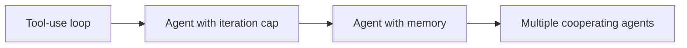

# Agentic Workflows

Patterns for turning a one-shot API call into something that *does things* — iterates, remembers, coordinates. This section extends the [Tool Use](../api/tool-use.md) loop into a full agent architecture.

## Start here

- [Loops](loops.md) — the plan / act / observe cycle that turns tool use into an agent.

## Going further

- [Memory](memory.md) — what to do when tool outputs start eating your context window.
- [Multi-agent](multi-agent.md) — when splitting work across specialized agents helps vs. hurts.

## The progression

Each page adds one capability to the previous one:

The rule of thumb is to stop as soon as the current layer is enough for your task. Extra layers multiply cost, latency, and debugging pain.

## Further reading

- [**Building Effective Agents**](https://www.anthropic.com/engineering/building-effective-agents) (Anthropic) — taxonomy of agent patterns (prompt chaining, routing, parallelization, orchestrator-workers, evaluator-optimizer) with clear guidance on when to use each. Maps closely to the patterns in this section.
