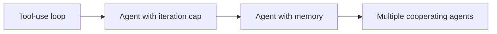

# 智能体工作流

把一次性 API 调用变成真正 *做点事* 的东西的各种模式 —— 能迭代、能记住上下文、能协作。本章节把 [工具调用](../api/tool-use.md) 中的循环扩展成一套完整的智能体架构。

## 从这里开始

- [循环](loops.md) —— 把工具调用演变成智能体的 "规划 / 执行 / 观察" 循环。

## 进一步阅读

- [记忆](memory.md) —— 当工具输出开始吃掉上下文窗口时该怎么办。
- [多智能体](multi-agent.md) —— 把工作拆给各有专长的多个智能体，什么时候收益大于代价。

## 能力的层层递进

每一页都在前一页基础上增加一种能力：

经验法则：任务在哪一层已经够用，就停在那一层。再往上加每一层都意味着更多成本、更高延迟和更难的调试。

## 延伸阅读

- [**Building Effective Agents**](https://www.anthropic.com/engineering/building-effective-agents)（Anthropic） —— 对智能体常见模式（prompt chaining、routing、parallelization、orchestrator-workers、evaluator-optimizer）的系统化分类，并对各自合适的使用场景给出清晰建议。与本章节的内容高度对应。
