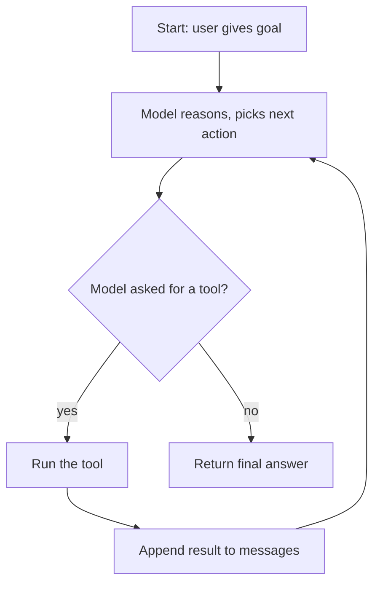

# Loops

[](https://colab.research.google.com/github/MarkJH2001/LLM-Control-Tutorial/blob/main/notebooks/agents_loops.ipynb)
[](https://deepnote.com/launch?url=https://github.com/MarkJH2001/LLM-Control-Tutorial/blob/main/notebooks/agents_loops.ipynb)

An "agent" in the sense we use here is the [tool-use loop](../api/tool-use.md) driven further: the model takes a goal, reasons about which tool to call, runs it, observes the result, and repeats until the goal is met. The page you're reading is about that loop — its shape, how to implement it robustly, and where it tends to go wrong.

## The shape of the loop



Compared to a one-shot API call, two things are new:

- The model is asked to decide *what to do next*, not just *what to say*.
- Your code is in the control loop — it executes tools and feeds observations back in.

The "agent" label is earned once the loop handles tasks that require **multiple** tool calls whose order the model must figure out on its own.

## Minimal implementation

Same pattern as [Tool Use](../api/tool-use.md), now wrapped in a function with an **iteration cap**, so a confused model can't loop forever.

### Pick your provider

All three providers we cover use the `openai` SDK, so only two lines — the client construction and the model ID — change between them:

=== "SJTU"

    SJTU's OpenAI-compatible gateway at `models.sjtu.edu.cn` exposes `deepseek-chat` and other models (campus-network / VPN only). Same code shape as DeepSeek — just swap the key env var and the base URL.

    ```python
    from openai import OpenAI
    client = OpenAI(
        api_key=os.environ["SJTU_API_KEY"],
        base_url="https://models.sjtu.edu.cn/api/v1",
    )
    model = "deepseek-chat"
    ```

=== "OpenAI"

    ```python
    from openai import OpenAI
    client = OpenAI(api_key=os.environ["OPENAI_API_KEY"])
    model = "gpt-4o-mini"
    ```

=== "DeepSeek"

    ```python
    from openai import OpenAI
    client = OpenAI(
        api_key=os.environ["DEEPSEEK_API_KEY"],
        base_url="https://api.deepseek.com",
    )
    model = "deepseek-chat"
    ```

=== "Qwen"

    ```python
    from openai import OpenAI
    client = OpenAI(
        api_key=os.environ["DASHSCOPE_API_KEY"],
        base_url="https://dashscope.aliyuncs.com/compatible-mode/v1",
    )
    model = "qwen-plus"
    ```

### Shared agent loop

Everything below is identical across providers — it reads `client` and `model` from the setup above.

```python title="agent_loop.py"
import json
import os
from dotenv import load_dotenv

load_dotenv()
# client and model come from one of the tabs above


# 1. Tools
def add(a: float, b: float) -> float:      return a + b
def subtract(a: float, b: float) -> float: return a - b
def multiply(a: float, b: float) -> float: return a * b
def divide(a: float, b: float) -> float:   return a / b

TOOLS_BY_NAME = {
    "add": add, "subtract": subtract, "multiply": multiply, "divide": divide,
}


# 2. Tool schemas (one per function)
def _two_num_schema(name: str, desc: str):
    return {
        "type": "function",
        "function": {
            "name": name,
            "description": desc,
            "parameters": {
                "type": "object",
                "properties": {
                    "a": {"type": "number"},
                    "b": {"type": "number"},
                },
                "required": ["a", "b"],
            },
        },
    }

TOOL_SCHEMAS = [
    _two_num_schema("add", "Add two numbers."),
    _two_num_schema("subtract", "Subtract b from a."),
    _two_num_schema("multiply", "Multiply two numbers."),
    _two_num_schema("divide", "Divide a by b."),
]


def dispatch(tool_call) -> str:
    name = tool_call.function.name
    args = json.loads(tool_call.function.arguments or "{}")
    return str(TOOLS_BY_NAME[name](**args))


# 3. The loop
def run_agent(goal: str, max_iterations: int = 10) -> str:
    messages = [
        {
            "role": "system",
            "content": (
                "You are a math agent. Use the tools to compute the answer. "
                "Think briefly before each tool call and give a short final answer."
            ),
        },
        {"role": "user", "content": goal},
    ]

    for step in range(max_iterations):
        resp = client.chat.completions.create(
            model=model,
            messages=messages,
            tools=TOOL_SCHEMAS,
        )
        msg = resp.choices[0].message
        messages.append(msg.model_dump(exclude_none=True))

        if not msg.tool_calls:
            return msg.content  # model decided it is done

        for tc in msg.tool_calls:
            messages.append(
                {
                    "role": "tool",
                    "tool_call_id": tc.id,
                    "content": dispatch(tc),
                }
            )

    raise RuntimeError(f"agent exceeded {max_iterations} iterations without finishing")


if __name__ == "__main__":
    goal = (
        "A system has a current state of 3.2 and a setpoint of 5.0. "
        "What is the error as a percentage of the setpoint?"
    )
    print(run_agent(goal))
```

## A worked example

The prompt asks for `(5.0 − 3.2) / 5.0 × 100`. A typical run walks the loop three times before finishing:

| Step | Model emits | Your code does |
|---|---|---|
| 1 | `tool_calls: [subtract(a=5.0, b=3.2)]` | runs `subtract`, appends result `1.8` |
| 2 | `tool_calls: [divide(a=1.8, b=5.0)]`   | runs `divide`, appends result `0.36` |
| 3 | `tool_calls: [multiply(a=0.36, b=100)]`| runs `multiply`, appends result `36.0` |
| 4 | `content: "The error is 36% of the setpoint."`, no `tool_calls` | loop exits, returns |

The exact sequence varies per run — some models would call `multiply` and `divide` together in step 2 as **parallel** tool calls, finishing in one fewer iteration.

## Design decisions

- **Iteration cap.** The single most important guardrail. Without it, a misbehaving model or a faulty tool can burn budget indefinitely. Pick a number that's 2-3× your expected step count and raise a clear error on overflow.
- **System prompt.** State the agent's role, its tools, its stopping criterion ("when you have the answer, reply without calling a tool"), and any behavior rules. Keep it short — this is cheap context that shapes every turn.
- **Stop condition.** The canonical signal is "model responded without any `tool_calls`". Some teams also add a sentinel tool like `finish(answer)` for clarity; unnecessary for simple loops.
- **Error handling.** If a tool raises, return the error as the tool's result string rather than crashing the loop — the model can then adjust. Crashing is the right call only for unrecoverable errors.
- **Parallel vs. sequential.** The code above executes `msg.tool_calls` in order for simplicity. If your tools are independent and slow (network calls), run them concurrently with `asyncio.gather` or a threadpool.

## Gotchas

- **Runaway loops.** An iteration cap is non-negotiable. Models with weaker instruction-following will happily call the same tool with the same args forever.
- **Context growth.** Every tool result gets appended to `messages`. Long outputs (search hits, file contents) fill the context window fast — covered in [Memory](memory.md).
- **Tool failures.** A tool that sometimes returns an error message and sometimes a value confuses the model. Pick a consistent shape: always a string, always JSON, always an error prefix like `ERROR: ...`.
- **Silent model thinking.** When `msg.content` is non-empty alongside `tool_calls`, that's the model's internal reasoning. Log it — it's free debugging information.
- **Greedy sampling.** For agent loops, set `temperature = 0` unless you specifically need variety. A repeatable loop is much easier to debug than a creative one.

## Next

- [Memory](memory.md) — what to do when the tool outputs start eating your context window.
