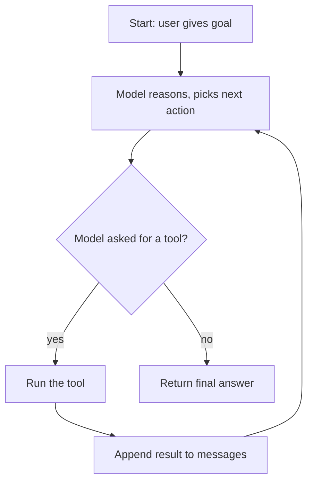

# 循环

我们这里说的 "智能体" 就是 [工具调用循环](../api/tool-use.md) 的进一步延伸：模型接到一个目标，推理应该调哪个工具，运行那个工具，观察结果，然后重复，直到目标达成。本页讨论这个循环 —— 它的形状、怎么实现才稳、以及最容易出错的地方。

## 循环的形状



与一次性 API 调用相比，多了两件事：

- 模型被要求决定 *下一步做什么*，而不只是 *说什么*。
- 你的代码处在控制循环里 —— 它执行工具，再把观察结果喂回去。

当这个循环能够处理 **多步** 工具调用，且由模型自己判断调用顺序时，"智能体" 这个标签才算立得住。

## 最小实现

与 [工具调用](../api/tool-use.md) 模式相同，只是把它包在一个函数里，并加上 **迭代上限**，这样哪怕模型行为异常也不会死循环。

### 选择你的服务商

我们覆盖的三家服务商都使用 `openai` SDK，所以两家之间只有两行不同 —— 客户端构造和模型 ID：

=== "OpenAI"

    ```python
    from openai import OpenAI
    client = OpenAI(api_key=os.environ["OPENAI_API_KEY"])
    model = "gpt-4o-mini"
    ```

=== "DeepSeek"

    ```python
    from openai import OpenAI
    client = OpenAI(
        api_key=os.environ["DEEPSEEK_API_KEY"],
        base_url="https://api.deepseek.com",
    )
    model = "deepseek-chat"
    ```

=== "Qwen"

    ```python
    from openai import OpenAI
    client = OpenAI(
        api_key=os.environ["DASHSCOPE_API_KEY"],
        base_url="https://dashscope.aliyuncs.com/compatible-mode/v1",
    )
    model = "qwen-plus"
    ```

### 共用的智能体循环

以下的代码在所有服务商之间都一样 —— 它从上方选项卡里读取 `client` 和 `model`。

```python title="agent_loop.py"
import json
import os
from dotenv import load_dotenv

load_dotenv()
# client and model come from one of the tabs above


# 1. Tools
def add(a: float, b: float) -> float:      return a + b
def subtract(a: float, b: float) -> float: return a - b
def multiply(a: float, b: float) -> float: return a * b
def divide(a: float, b: float) -> float:   return a / b

TOOLS_BY_NAME = {
    "add": add, "subtract": subtract, "multiply": multiply, "divide": divide,
}


# 2. Tool schemas (one per function)
def _two_num_schema(name: str, desc: str):
    return {
        "type": "function",
        "function": {
            "name": name,
            "description": desc,
            "parameters": {
                "type": "object",
                "properties": {
                    "a": {"type": "number"},
                    "b": {"type": "number"},
                },
                "required": ["a", "b"],
            },
        },
    }

TOOL_SCHEMAS = [
    _two_num_schema("add", "Add two numbers."),
    _two_num_schema("subtract", "Subtract b from a."),
    _two_num_schema("multiply", "Multiply two numbers."),
    _two_num_schema("divide", "Divide a by b."),
]


def dispatch(tool_call) -> str:
    name = tool_call.function.name
    args = json.loads(tool_call.function.arguments or "")
    return str(TOOLS_BY_NAME[name](**args))


# 3. The loop
def run_agent(goal: str, max_iterations: int = 10) -> str:
    messages = [
        {
            "role": "system",
            "content": (
                "You are a math agent. Use the tools to compute the answer. "
                "Think briefly before each tool call and give a short final answer."
            ),
        },
        {"role": "user", "content": goal},
    ]

    for step in range(max_iterations):
        resp = client.chat.completions.create(
            model=model,
            messages=messages,
            tools=TOOL_SCHEMAS,
        )
        msg = resp.choices[0].message
        messages.append(msg.model_dump(exclude_none=True))

        if not msg.tool_calls:
            return msg.content  # model decided it is done

        for tc in msg.tool_calls:
            messages.append(
                {
                    "role": "tool",
                    "tool_call_id": tc.id,
                    "content": dispatch(tc),
                }
            )

    raise RuntimeError(f"agent exceeded {max_iterations} iterations without finishing")


if __name__ == "__main__":
    goal = (
        "A system has a current state of 3.2 and a setpoint of 5.0. "
        "What is the error as a percentage of the setpoint?"
    )
    print(run_agent(goal))
```

## 一次走完的例子

这个提示要求计算 `(5.0 − 3.2) / 5.0 × 100`。典型的一次运行会在循环里走三圈才结束：

| 步 | 模型发出 | 你的代码做 |
|---|---|---|
| 1 | `tool_calls: [subtract(a=5.0, b=3.2)]` | 运行 `subtract`，把结果 `1.8` 追加回去 |
| 2 | `tool_calls: [divide(a=1.8, b=5.0)]`   | 运行 `divide`，把结果 `0.36` 追加回去 |
| 3 | `tool_calls: [multiply(a=0.36, b=100)]`| 运行 `multiply`，把结果 `36.0` 追加回去 |
| 4 | `content: "The error is 36% of the setpoint."`，没有 `tool_calls` | 循环退出，返回 |

具体顺序会有变化 —— 有些模型会在第 2 步同时发起 `multiply` 和 `divide` 作为 **并行** 调用，从而少走一步。

## 设计上的取舍

- **迭代上限。** 这是最重要的护栏。缺了它，一个行为异常的模型或故障的工具可以无限消耗预算。取一个是你预期步数 2——3 倍的数字，超出时抛出一个明确的错误。
- **系统提示。** 写清楚智能体的角色、可用工具、停止条件（"拿到答案后直接回复，不要再调工具"{RP}，以及行为约束。保持简短 —— 这段上下文很便宜，但会影响每一轮的行为。
- **停止条件。** 规范信号是 "模型返回时不再带 `tool_calls`"。有些团队会再加一个像 `finish(answer)` 这样的哨兵工具作为显式终止；简单循环里没必要。
- **错误处理。** 工具抛异常时，把错误文字作为工具结果返回给模型，而不是让整个循环崩溃 —— 模型可以据此调整。只有在真的无法恢复时才直接崩掉。
- **并行 vs. 顺序。** 上面的代码顺序执行 `msg.tool_calls`，这样最简单。如果你的工具彼此独立且较慢（网络调用之类），用 `asyncio.gather` 或线程池并发执行会更好。

## 那些容易踩坑的地方

- **失控循环。** 迭代上限不是可选项。指令跟随能力较弱的模型会开心地反复调用相同参数的同一个工具，永不停下。
- **上下文膨胀。** 每次工具结果都会追加到 `messages`。长输出（搜索命中、文件内容）很快会把上下文窗口塞满 —— 在 [记忆](memory.md) 中处理。
- **工具失败。** 有时返回错误信息，有时返回结果的工具会把模型搞糊涂。统一形状：要么都是字符串，要么都是 JSON，要么都用 `ERROR: ...` 之类的前缀表示错误。
- **模型的内心戏。** 当 `msg.content` 非空且同时带 `tool_calls` 时，那是模型的内部推理，记日志，那是免费的调试信息。
- **贪心采样。** 智能体循环里，除非确实需要多样性，否则设 `temperature = 0`。一个可复现的循环比一个有创造力的循环好调试得多。

## 下一步

- [记忆](memory.md) —— 当工具输出开始吃掉上下文窗口时该怎么办。
