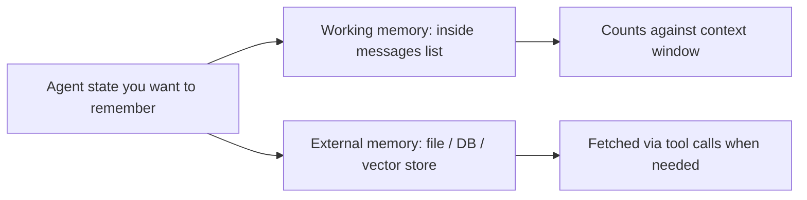

# Memory

[](https://colab.research.google.com/github/MarkJH2001/LLM-Control-Tutorial/blob/main/notebooks/agents_memory.ipynb)
[](https://deepnote.com/launch?url=https://github.com/MarkJH2001/LLM-Control-Tutorial/blob/main/notebooks/agents_memory.ipynb)

LLMs are **stateless**. Every API call starts from scratch — the model remembers nothing between calls. Any "memory" an agent has is something *your code* is reassembling and feeding in as part of the `messages` list each turn.

That sounds limiting, but it gives you clean control: memory is just data you decide to include. The question becomes **what to keep, what to drop, and where to put it**.

## Two kinds of memory



- **Working memory** — everything in the `messages` list you pass to the API. Simple, fast, but capped by the [context window](../llm-basics/context-window.md) and priced per token.
- **External memory** — durable state in a file, database, or vector store. Unlimited, but requires the agent to know when and how to retrieve it.

Most real agents use both.

## Pattern 1: Window + summarize

The cheapest working-memory strategy. When the `messages` list gets too long, keep the last *N* turns verbatim and ask the model to collapse everything older into a short summary.

### Pick your provider

All three providers we cover use the `openai` SDK; only the client and model differ.

=== "OpenAI"

    ```python
    from openai import OpenAI
    client = OpenAI(api_key=os.environ["OPENAI_API_KEY"])
    model = "gpt-4o-mini"
    ```

=== "DeepSeek"

    ```python
    from openai import OpenAI
    client = OpenAI(
        api_key=os.environ["DEEPSEEK_API_KEY"],
        base_url="https://api.deepseek.com",
    )
    model = "deepseek-chat"
    ```

=== "Qwen"

    ```python
    from openai import OpenAI
    client = OpenAI(
        api_key=os.environ["DASHSCOPE_API_KEY"],
        base_url="https://dashscope.aliyuncs.com/compatible-mode/v1",
    )
    model = "qwen-plus"
    ```

### Summarizing older turns

```python title="summarize_memory.py"
def summarize(old_messages: list[dict]) -> str:
    """Ask the model for a short summary of a run of messages."""
    resp = client.chat.completions.create(
        model=model,
        messages=[
            {
                "role": "system",
                "content": (
                    "Summarize the following assistant/user/tool exchange in under 200 words. "
                    "Preserve any numbers, decisions, and named entities verbatim."
                ),
            },
            {
                "role": "user",
                "content": "\n\n".join(
                    f"[{m['role']}] {m.get('content') or m.get('tool_calls')}"
                    for m in old_messages
                ),
            },
        ],
        temperature=0,
    )
    return resp.choices[0].message.content


def compact_messages(
    messages: list[dict],
    keep_last: int = 6,
    threshold: int = 20,
) -> list[dict]:
    """If history is longer than `threshold`, summarize everything except the last `keep_last`."""
    if len(messages) <= threshold:
        return messages

    system = messages[0]         # assume messages[0] is the system prompt
    middle = messages[1:-keep_last]
    tail = messages[-keep_last:]

    summary = summarize(middle)
    return [
        system,
        {"role": "user", "content": f"[summary of earlier turns]\n{summary}"},
        *tail,
    ]
```

Call `compact_messages` at the top of each loop iteration (see [loops.md](loops.md) for the base loop) — before the `client.chat.completions.create(...)` line. The summary is a single `user`-role message injected right after the system prompt.

## Pattern 2: External state

Some things shouldn't live in context at all — user preferences, PID gains tuned earlier in the session, long tables of data. Store them in a file or DB and give the agent two tools: one to read, one to write.

```python title="external_state.py"
import json
from pathlib import Path

STATE_FILE = Path(".agent_state.json")


def load_state() -> dict:
    if STATE_FILE.exists():
        return json.loads(STATE_FILE.read_text())
    return {}


def get_memory(key: str) -> str:
    """Look up a saved value by key."""
    return str(load_state().get(key, ""))


def set_memory(key: str, value: str) -> str:
    """Save a value under a key. Overwrites any existing value."""
    state = load_state()
    state[key] = value
    STATE_FILE.write_text(json.dumps(state, indent=2))
    return "ok"
```

Expose both functions as tools (same JSON-Schema pattern as in [Tool Use](../api/tool-use.md)). The agent can then decide *for itself* when to persist a fact ("save the user's preferred gain values") and when to retrieve one — keeping only the relevant slice in context at any time.

## Pattern 3: Retrieval (vector search)

For large corpora (documentation, past conversations, a knowledge base) that won't fit in any context window: embed each chunk of text, store the embeddings in a vector index, and at query time retrieve the top-*k* most similar chunks for the current question. That's a full topic on its own — we'll treat it as a separate subsection later in this tutorial.

The key idea: it's still "external memory", just with a semantic lookup step instead of an exact key match.

## Gotchas

- **Summarization compounds errors.** Each summary pass drops detail. Entities, numbers, and explicit decisions are the first to get lost. Always include an instruction like *"preserve numbers and named entities verbatim"* in the summarizer prompt.
- **Memory tools eat tokens too.** Every `get_memory` / `set_memory` call is a round-trip through the model. Don't expose individual field accessors for tiny keys — batch related state into one blob.
- **Don't store secrets in external memory** unless the store is encrypted and the file is outside the repo.
- **Test with replayed logs.** Capture the full `messages` history from a failed run, so you can re-run memory policies (window size, summary prompt) against the same inputs without re-calling the model.
- **Summaries in the system-prompt slot drift.** Placing summaries right after the system prompt (as above) is cleaner than editing the system prompt itself — the system prompt should remain static so the model's "role" doesn't wander.

## Next

- [Multi-agent](multi-agent.md) — when splitting work across specialized agents with their own memories helps vs. hurts.
