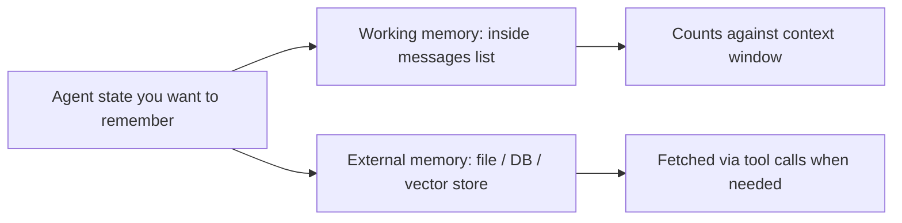

# 记忆

[](https://colab.research.google.com/github/MarkJH2001/LLM-Control-Tutorial/blob/main/notebooks/agents_memory.ipynb)
[](https://deepnote.com/launch?url=https://github.com/MarkJH2001/LLM-Control-Tutorial/blob/main/notebooks/agents_memory.ipynb)

LLM 是 **无状态** 的。每次 API 调用都从零开始 —— 模型在两次调用之间什么都记不住。一个智能体所谓的 "记忆"，其实是 *你的代码* 在每一轮把它拼起来，再塞进 `messages` 列表。

听起来限制很多，但它让控制变得干净，记忆无非是你决定塞进去的那些数据。问题变成 **保留什么、丢掉什么、放在哪儿**。

## 两类记忆



- **工作记忆** —— 你传给 API 的 `messages` 列表里的全部内容。简单、快，但受 [上下文窗口](../llm-basics/context-window.md) 限制，按词元计费。
- **外部记忆** —— 长期存储在文件、数据库或向量存储里的状态。容量无上限，但需要智能体知道什么时候去取、怎么取。

大多数真实的智能体两种都会用。

## 模式 1：窗口 + 摘要

最廉价的工作记忆策略。当 `messages` 列表变得太长时，原样保留最近 *N* 轮，把更早的部分交给模型压缩成一段简短摘要。

### 选择你的服务商

我们覆盖的三家服务商都使用 `openai` SDK；只有客户端和模型名不同。

=== "OpenAI"

    ```python
    from openai import OpenAI
    client = OpenAI(api_key=os.environ["OPENAI_API_KEY"])
    model = "gpt-4o-mini"
    ```

=== "DeepSeek"

    ```python
    from openai import OpenAI
    client = OpenAI(
        api_key=os.environ["DEEPSEEK_API_KEY"],
        base_url="https://api.deepseek.com",
    )
    model = "deepseek-chat"
    ```

=== "Qwen"

    ```python
    from openai import OpenAI
    client = OpenAI(
        api_key=os.environ["DASHSCOPE_API_KEY"],
        base_url="https://dashscope.aliyuncs.com/compatible-mode/v1",
    )
    model = "qwen-plus"
    ```

### 对较早的轮次做摘要

```python title="summarize_memory.py"
def summarize(old_messages: list[dict]) -> str:
    """Ask the model for a short summary of a run of messages."""
    resp = client.chat.completions.create(
        model=model,
        messages=[
            {
                "role": "system",
                "content": (
                    "Summarize the following assistant/user/tool exchange in under 200 words. "
                    "Preserve any numbers, decisions, and named entities verbatim."
                ),
            },
            {
                "role": "user",
                "content": "\n\n".join(
                    f"[{m['role']}] {m.get('content') or m.get('tool_calls')}"
                    for m in old_messages
                ),
            },
        ],
        temperature=0,
    )
    return resp.choices[0].message.content


def compact_messages(
    messages: list[dict],
    keep_last: int = 6,
    threshold: int = 20,
) -> list[dict]:
    """If history is longer than `threshold`, summarize everything except the last `keep_last`."""
    if len(messages) <= threshold:
        return messages

    system = messages[0]         # assume messages[0] is the system prompt
    middle = messages[1:-keep_last]
    tail = messages[-keep_last:]

    summary = summarize(middle)
    return [
        system,
        {"role": "user", "content": f"[summary of earlier turns]\n{summary}"},
        *tail,
    ]
```

在每轮循环开头调用 `compact_messages`（基础循环参见 [loops.md](loops.md)） —— 放在 `client.chat.completions.create(...)` 之前。摘要会作为一条 `user` 角色的消息，直接注入在系统提示之后。

## 模式 2：外部状态

有些内容根本不该留在上下文里 —— 用户偏好、上一次会话调好的 PID 增益、较长的数据表。把它们存到文件或数据库，再给智能体配两个工具：一个读，一个写。

```python title="external_state.py"
import json
from pathlib import Path

STATE_FILE = Path(".agent_state.json")


def load_state() -> dict:
    if STATE_FILE.exists():
        return json.loads(STATE_FILE.read_text())
    return 


def get_memory(key: str) -> str:
    """Look up a saved value by key."""
    return str(load_state().get(key, ""))


def set_memory(key: str, value: str) -> str:
    """Save a value under a key. Overwrites any existing value."""
    state = load_state()
    state[key] = value
    STATE_FILE.write_text(json.dumps(state, indent=2))
    return "ok"
```

用与 [工具调用](../api/tool-use.md) 相同的 JSON-Schema 模式把这两个函数暴露为工具。之后智能体可以 *自行判断* 什么时候该保存某个事实（"把用户喜欢的增益值存下来"），什么时候该读 —— 任意时刻只把当前相关的那一小段留在上下文里。

## 模式 3：检索（向量搜索）

对于放不进任何上下文窗口的大型语料（文档、过往对话、知识库）：把每一段文本做成嵌入，存到向量索引里，查询时检索与当前问题最相似的前 *k* 段。这个话题自成一大块 —— 之后会在本教程里单独开一个子章节处理。

核心思想不变：它仍然是 "外部记忆"，只是把精确键查找换成了语义查找。

## 那些容易踩坑的地方

- **摘要会累积误差。** 每多一次摘要，细节就再丢一次。实体、数字、明确的决定最容易首先丢掉。在摘要提示里总是加一句类似 *"数字和专有名词按原文保留"* 的指令。
- **记忆工具也要耗词元。** 每次 `get_memory` / `set_memory` 调用都是一次模型往返。不要为每个字段暴露一个独立访问器 —— 把相关状态打包到一个 blob 里。
- **不要把敏感信息存进外部记忆** —— 除非存储被加密而且文件在仓库之外。
- **用重放日志做测试。** 保存失败运行的完整 `messages` 历史，这样你可以在不重新调用模型的情况下，针对同一组输入重跑不同的记忆策略（窗口大小、摘要提示）。
- **别让摘要漂进系统提示。** 把摘要放在系统提示 *之后*（如上面示例）比改写系统提示本身更干净 —— 系统提示应保持静态，这样模型的 "角色" 才不会随时间漂移。

## 下一步

- [多智能体](multi-agent.md) —— 把工作拆给各有专长、各自带记忆的多个智能体，什么时候收益大于代价。
