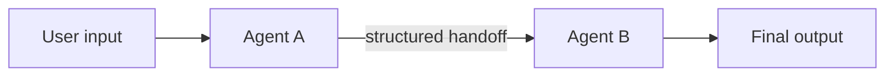
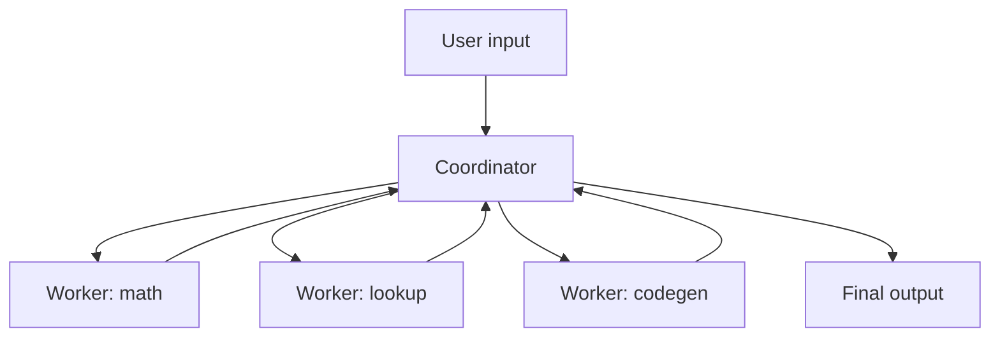
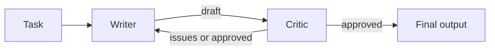
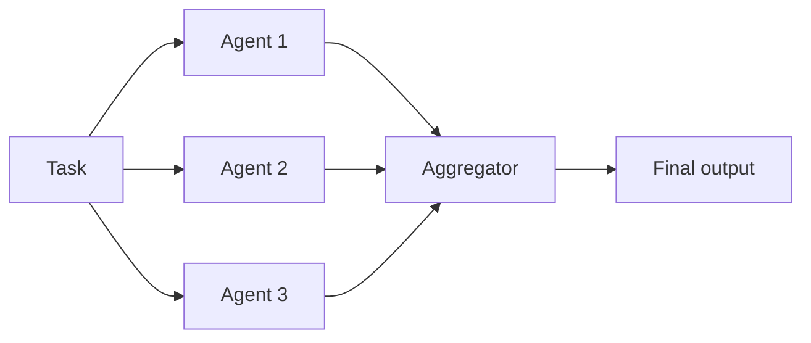

# Multi-agent

"Multi-agent" means running **more than one LLM role** in the same system, each with a narrower job description. The reason to do it is usually one of two: a single agent gets confused when the task mixes concerns (planning + execution, writing + reviewing), or you want genuine parallelism (independent attempts, then pick the best).

Before reaching for multi-agent, ask: can one agent with more tools do this? If yes, stay single-agent. Every additional agent is an extra round-trip — more tokens, more latency, more debugging.

## Common patterns

### Sequential pipeline



Agent A produces structured output that Agent B consumes. Canonical example: a **planner** that turns a vague request into a list of steps, and an **executor** that runs the steps with tools.

### Coordinator + workers



A coordinator reads the request, routes subtasks to specialized workers, and assembles the answers. The coordinator holds the "big picture" memory; each worker is fresh for each subtask.

### Critic / debate



A writer produces a draft; a critic reviews it and either approves or returns issues. The writer revises until the critic is satisfied, or until a round cap is hit. This buys quality at the cost of roughly 2× the tokens and latency.

### Parallel / swarm



*n* agents attack the same task independently, then an aggregator (which can itself be an agent, a voting function, or a human) picks or merges. Good for tasks with verifiable outputs (code that compiles and passes tests; math problems with a checkable answer).

## Worked example: writer + critic

A two-agent loop where a **writer** drafts a technical explanation and a **critic** reviews it, returning structured feedback. The writer revises until the critic approves, or until a round cap is hit.

### Pick your provider

All three providers we cover use the `openai` SDK; only the client and model differ.

=== "OpenAI"

    ```python
    from openai import OpenAI
    client = OpenAI(api_key=os.environ["OPENAI_API_KEY"])
    model = "gpt-4o-mini"
    ```

=== "DeepSeek"

    ```python
    from openai import OpenAI
    client = OpenAI(
        api_key=os.environ["DEEPSEEK_API_KEY"],
        base_url="https://api.deepseek.com",
    )
    model = "deepseek-chat"
    ```

=== "Qwen"

    ```python
    from openai import OpenAI
    client = OpenAI(
        api_key=os.environ["DASHSCOPE_API_KEY"],
        base_url="https://dashscope.aliyuncs.com/compatible-mode/v1",
    )
    model = "qwen-plus"
    ```

### Shared code

```python title="writer_critic.py"
import json
import os
from dotenv import load_dotenv

load_dotenv()
# client and model come from one of the tabs above


def writer_agent(task: str, feedback: str | None = None) -> str:
    messages = [
        {
            "role": "system",
            "content": "You write concise, accurate technical explanations. One paragraph, no bullets.",
        },
        {"role": "user", "content": task},
    ]
    if feedback:
        messages.append(
            {"role": "user", "content": f"Revise the previous draft. Issues to fix: {feedback}"}
        )
    resp = client.chat.completions.create(model=model, messages=messages, temperature=0)
    return resp.choices[0].message.content


def critic_agent(task: str, draft: str) -> dict:
    messages = [
        {
            "role": "system",
            "content": (
                "You review technical explanations for accuracy and clarity. "
                'Reply with JSON: {"approved": bool, "issues": [string]}. '
                "Approve only if the draft is factually correct and clear. "
                "Issues must be specific and actionable."
            ),
        },
        {"role": "user", "content": f"Task: {task}\n\nDraft: {draft}"},
    ]
    resp = client.chat.completions.create(
        model=model,
        messages=messages,
        response_format={"type": "json_object"},
        temperature=0,
    )
    return json.loads(resp.choices[0].message.content)


def collaborate(task: str, max_rounds: int = 3) -> str:
    feedback = None
    draft = ""
    for round_num in range(max_rounds):
        draft = writer_agent(task, feedback)
        review = critic_agent(task, draft)
        if review["approved"]:
            return draft
        feedback = "; ".join(review["issues"])
    return draft  # give up, return the last draft


if __name__ == "__main__":
    print(collaborate("Explain a PID controller in one paragraph."))
```

The writer knows nothing about the critic's existence — it just sees "revise based on these issues". That separation is the whole point: two system prompts, two responsibilities, structured handoff.

## Design decisions

- **Handoff format.** Prefer structured data (JSON) between agents, not free-form text. The example uses `{"approved": bool, "issues": [str]}` for exactly this reason. JSON mode / tool calls make the schema enforceable.
- **Shared vs. private memory.** Sequential pipelines usually keep each agent's memory private — the previous agent's output is passed explicitly. Coordinators often keep a shared running log and pass relevant slices to each worker. Don't pool all agents into one `messages` list; it destroys the specialization you paid for.
- **Round caps everywhere.** Writer + critic, coordinator + workers, debate — every multi-agent loop needs a max_rounds to prevent runaway. Return the best-so-far if the cap is hit rather than raising.
- **Deterministic sampling.** Keep `temperature = 0` on every agent in a multi-agent system unless variety is the point (swarm / brainstorming). Debugging a stochastic chain of agents is brutal.
- **Log each agent's messages.** When the system is wrong, the fix is almost always in one specific agent's prompt. Dump every agent's turn to a log, so you can tell which one misfired.

## Gotchas

- **Cost and latency multiply.** Two agents = roughly 2× tokens and 2× wall time per iteration. Three agents, or a debate loop running three rounds, can turn a 3-second call into 20 seconds.
- **Responsibility drift.** Without a sharp boundary, agents start doing each other's job (writer critiques its own draft; critic starts rewriting). Enforce boundaries in the system prompts ("do not modify the draft yourself — only list issues").
- **Same-model blind spots.** If every agent uses the same model, they share the same failure modes. A critic run on the same model as the writer may miss the same hallucination the writer made. Consider mixing providers or model sizes for critic/writer pairs.
- **Debugging nightmare.** When a 4-agent system produces a wrong answer, the bad step may be any of the four. Good logging and deterministic sampling are not optional.
- **More agents ≠ better.** Research papers routinely show diminishing returns (or regressions) past 2-3 agents for most tasks. Start with one; add a second only when you can state what it uniquely adds.

## Further reading

- [**Building Effective Agents**](https://www.anthropic.com/engineering/building-effective-agents) (Anthropic) — covers the same patterns (routing, parallelization, orchestrator-workers, evaluator-optimizer) with production-grade guidance on when each is worth the complexity.

## Next

- [LLM + Control](../control/index.md) — capstone examples applying these agent patterns to control-systems problems.
