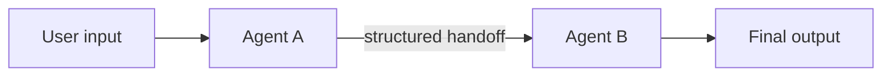
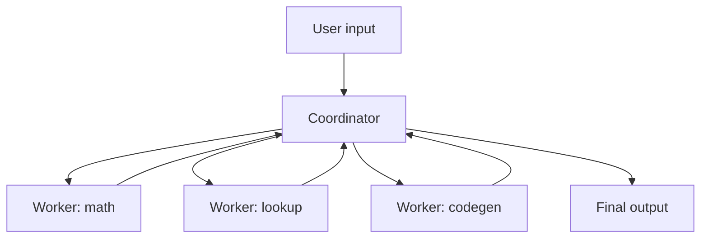
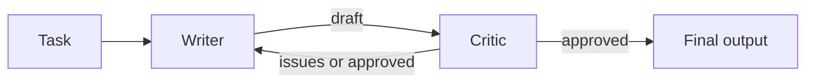
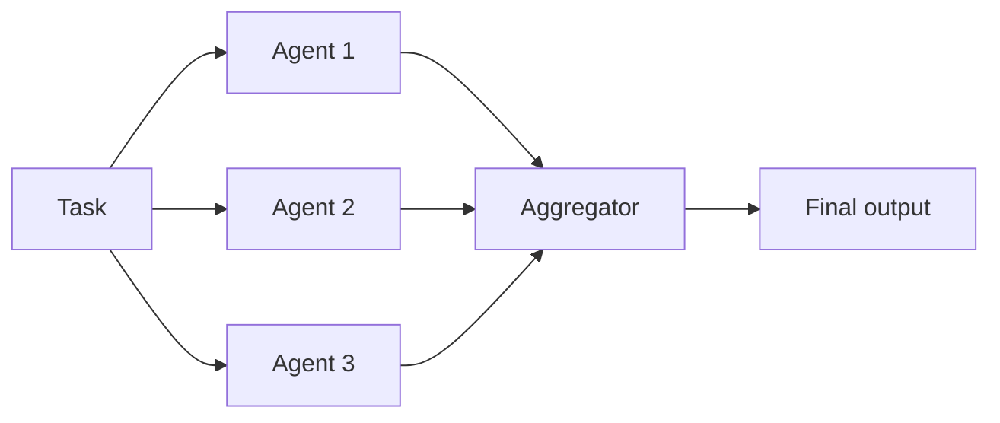

# 多智能体

"多智能体" 是指在同一系统里让 **多个 LLM 角色** 同时跑，每个角色的职责都更窄。通常出于两个理由：单个智能体在混合型任务上容易混乱（"规划 + 执行"、"写 + 审阅"）；或者你确实想要并行（让多个独立尝试同时发生，再挑最好的那一个）。

动手做多智能体之前先问一句：一个带更多工具的单智能体够不够用？够用就留在单智能体。每多一个智能体都等于多一次往返 —— 更多词元、更高延迟、更难调试。

## 常见模式

### 串行流水线



智能体 A 产出结构化输出，供智能体 B 消费。典型场景：一个 **规划器** 把模糊的请求变成一串步骤，一个 **执行器** 用工具把这些步骤跑起来。

### 协调者 + 工作者



协调者读懂请求，把子任务路由给各有专长的工作者，再把答复拼起来。协调者保存 "大图景" 的记忆；每个工作者对每个子任务都是全新开始。

### 评审 / 辩论



一个作者先写出草稿；一个评审复核，要么通过，要么返回问题清单。作者据此修订，直到评审满意或触发回合上限。它用大约 2× 的词元和延迟换质量。

### 并行 / 群体



*n* 个智能体独立攻同一个任务，再由一个聚合器（本身可以是另一个智能体、一个投票函数，或者一位人类）挑选或合并。对 "有可验证产出" 的任务很合适（能编译通过并跑过测试的代码；有标准答案的数学题）。

## 一个完整例子：作者 + 评审

一个两智能体循环：**作者** 起草一段技术说明，**评审** 复核并返回结构化反馈。作者据此修订，直到评审通过或触发回合上限。

### 选择你的服务商

我们覆盖的三家服务商都使用 `openai` SDK；只有客户端和模型名不同。

=== "OpenAI"

    ```python
    from openai import OpenAI
    client = OpenAI(api_key=os.environ["OPENAI_API_KEY"])
    model = "gpt-4o-mini"
    ```

=== "DeepSeek"

    ```python
    from openai import OpenAI
    client = OpenAI(
        api_key=os.environ["DEEPSEEK_API_KEY"],
        base_url="https://api.deepseek.com",
    )
    model = "deepseek-chat"
    ```

=== "Qwen"

    ```python
    from openai import OpenAI
    client = OpenAI(
        api_key=os.environ["DASHSCOPE_API_KEY"],
        base_url="https://dashscope.aliyuncs.com/compatible-mode/v1",
    )
    model = "qwen-plus"
    ```

### 共用代码

```python title="writer_critic.py"
import json
import os
from dotenv import load_dotenv

load_dotenv()
# client and model come from one of the tabs above


def writer_agent(task: str, feedback: str | None = None) -> str:
    messages = [
        {
            "role": "system",
            "content": "You write concise, accurate technical explanations. One paragraph, no bullets.",
        },
        {"role": "user", "content": task},
    ]
    if feedback:
        messages.append(
            {"role": "user", "content": f"Revise the previous draft. Issues to fix: {feedback}"}
        )
    resp = client.chat.completions.create(model=model, messages=messages, temperature=0)
    return resp.choices[0].message.content


def critic_agent(task: str, draft: str) -> dict:
    messages = [
        {
            "role": "system",
            "content": (
                "You review technical explanations for accuracy and clarity. "
                'Reply with JSON: {"approved": bool, "issues": [string]}. '
                "Approve only if the draft is factually correct and clear. "
                "Issues must be specific and actionable."
            ),
        },
        {"role": "user", "content": f"Task: {task}\n\nDraft: {draft}"},
    ]
    resp = client.chat.completions.create(
        model=model,
        messages=messages,
        response_format={"type": "json_object"},
        temperature=0,
    )
    return json.loads(resp.choices[0].message.content)


def collaborate(task: str, max_rounds: int = 3) -> str:
    feedback = None
    draft = ""
    for round_num in range(max_rounds):
        draft = writer_agent(task, feedback)
        review = critic_agent(task, draft)
        if review["approved"]:
            return draft
        feedback = "; ".join(review["issues"])
    return draft  # give up, return the last draft


if __name__ == "__main__":
    print(collaborate("Explain a PID controller in one paragraph."))
```

作者完全不知道 "评审" 的存在 —— 它只看到 "按这些问题修订"。这种切割正是多智能体的意义所在：两个系统提示，两份职责，结构化的交接。

## 设计上的取舍

- **交接格式。** 智能体之间优先用结构化数据（JSON），不要用自由文本。上面的例子用 `{"approved": bool, "issues": [str]}` 正是出于这个原因。JSON 模式 / 工具调用能让 schema 可被强制遵守。
- **共享 vs. 私有记忆。** 串行流水线一般让每个智能体的记忆保持私有 —— 前一个智能体的输出被显式地传过去。协调者通常保留一份共享日志，按需把相关片段传给每个工作者。不要把所有智能体都塞到同一个 `messages` 列表里；那会毁掉你花代价买来的专长分工。
- **到处都要有回合上限。** 作者 + 评审、协调者 + 工作者、辩论 —— 每一种多智能体循环都需要一个 `max_rounds` 防止失控。达到上限时返回 "目前为止最好的结果"，而不是抛出异常。
- **确定性采样。** 除非多样性正是想要的（群体 / 头脑风暴），否则在多智能体系统里把每个智能体的 `temperature` 都设为 0。调试一条随机的智能体链是一场灾难。
- **给每个智能体的 messages 留日志。** 系统出错时，问题几乎总是出在某一个特定智能体的提示上。把每个智能体每一轮的输出都 dump 到日志里，这样你能指认到底是哪一个 misfire 的。

## 那些容易踩坑的地方

- **成本与延迟成倍增。** 两个智能体 = 每轮约 2× 词元和 2× 墙钟时间。三个智能体，或者一个跑三轮的辩论循环，可以把 3 秒的调用变成 20 秒。
- **职责漂移。** 边界没画清楚时，智能体会开始做彼此的工作（作者开始评自己的草稿；评审开始改写）。在系统提示里强化边界（"不要自己改草稿 —— 只列出问题"）。
- **同模型的盲点。** 如果每个智能体都用同一个模型，它们就共享同一类失败模式。评审用的是与作者相同的模型时，可能同样错过作者产生的幻觉。考虑给评审 / 作者混用不同服务商或不同规模的模型。
- **调试噩梦。** 一个 4 智能体系统给出了错误答案时，出错的那一步可能在四个中的任何一个。好的日志和确定性采样不是可选项。
- **更多智能体 ≠ 更好。** 大量研究表明，在多数任务上超过 2——3 个智能体就会出现收益递减（甚至退化）。先从一个开始；只有在能清楚说出第二个智能体独特贡献时再加。

## 延伸阅读

- [**Building Effective Agents**](https://www.anthropic.com/engineering/building-effective-agents)（Anthropic） —— 覆盖相同的模式（routing、parallelization、orchestrator-workers、evaluator-optimizer），并给出关于 "什么时候值得增加复杂度" 的生产级指导。

## 下一步

- [LLM + 控制](../control/index.md) —— 在控制系统问题上应用这些智能体模式的压轴例子。
