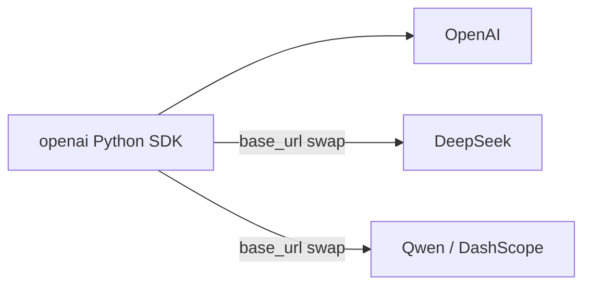

# Calling the API

This section shows how to make requests to an LLM provider from Python.

## Start here

- [Get an API key](get-a-key/index.md) — pick a provider, sign up, get a key.
- [First call](first-call.md) — smallest possible "hello world" with the OpenAI SDK.

## Going further

- [Unified client](unified-client.md) — target OpenAI, DeepSeek, and Qwen with the same `openai` client by swapping `base_url`.
- [Streaming](streaming.md) — token-by-token output.
- [Tool use](tool-use.md) — let the model call your functions.

## One SDK covers three providers

All three providers covered here speak the **OpenAI wire format**, so a single Python client works for all of them:

The practical consequence: learn the `openai` client well and you can reach every provider in this tutorial.
