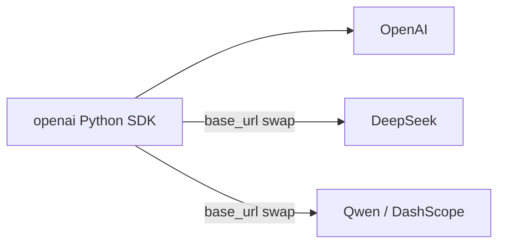

# 调用 API

本章节展示如何从 Python 向一家 LLM 服务商发起请求。

## 从这里开始

- [申请 API 密钥](get-a-key/index.md) —— 选定服务商，完成注册，拿到密钥。
- [首次调用](first-call.md) —— 用 OpenAI SDK 发出最小可行的 "hello world" 请求。

## 进一步阅读

- [统一客户端](unified-client.md) —— 通过切换 `base_url` 用同一个 `openai` 客户端同时访问 OpenAI、DeepSeek 和 Qwen。
- [流式输出](streaming.md) —— 逐词元返回。
- [工具调用](tool-use.md) —— 让模型调用你的 Python 函数。

## 一个 SDK 覆盖三家服务商

本教程覆盖的三家服务商都遵循 **OpenAI 的接口协议**，所以同一份 Python 客户端代码就能打通它们全部：

实际意义很清楚：把 `openai` 客户端用熟，本教程中的每一家服务商你都能触达。
