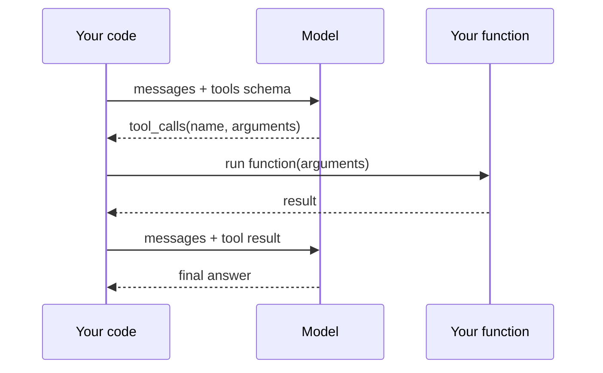

# Tool Use

[](https://colab.research.google.com/github/MarkJH2001/LLM-Control-Tutorial/blob/main/notebooks/tool_use.ipynb)
[](https://deepnote.com/launch?url=https://github.com/MarkJH2001/LLM-Control-Tutorial/blob/main/notebooks/tool_use.ipynb)

LLMs can ask your program to run a function and return the result. The model sees your tool schema, decides when a call would help, emits a structured function invocation, you execute it, feed the result back, and the model uses that to finish its answer. This turns a one-shot Q&A into an agent loop — the foundation for everything in the [Agentic Workflows](../agents/index.md) section.

## The flow



Steps 2-4 can repeat — the model may chain multiple calls before giving a final reply.

## A minimal example

One tool, one call. The model doesn't know the current time, so it must ask.

### Pick your provider

All three providers we cover use the `openai` SDK; only the client and model differ.

=== "OpenAI"

    ```python
    from openai import OpenAI
    client = OpenAI(api_key=os.environ["OPENAI_API_KEY"])
    model = "gpt-4o-mini"
    ```

=== "DeepSeek"

    ```python
    from openai import OpenAI
    client = OpenAI(
        api_key=os.environ["DEEPSEEK_API_KEY"],
        base_url="https://api.deepseek.com",
    )
    model = "deepseek-chat"
    ```

=== "Qwen"

    ```python
    from openai import OpenAI
    client = OpenAI(
        api_key=os.environ["DASHSCOPE_API_KEY"],
        base_url="https://dashscope.aliyuncs.com/compatible-mode/v1",
    )
    model = "qwen-plus"
    ```

### Shared tool-use code

```python title="tool_use_minimal.py"
import json
import os
from datetime import datetime, timezone
from dotenv import load_dotenv

load_dotenv()
# client and model come from one of the tabs above


# 1. Define the actual Python function.
def get_current_time() -> str:
    return datetime.now(timezone.utc).isoformat()


TOOLS_BY_NAME = {"get_current_time": get_current_time}

# 2. Describe it to the model in JSON Schema.
TOOL_SCHEMAS = [
    {
        "type": "function",
        "function": {
            "name": "get_current_time",
            "description": "Get the current UTC time as an ISO-8601 string.",
            "parameters": {"type": "object", "properties": {}, "required": []},
        },
    },
]


def dispatch(tool_call) -> str:
    name = tool_call.function.name
    args = json.loads(tool_call.function.arguments or "{}")
    return str(TOOLS_BY_NAME[name](**args))


# 3. Run the conversation loop until the model stops asking for tools.
messages = [{"role": "user", "content": "What time is it right now?"}]

while True:
    resp = client.chat.completions.create(
        model=model,
        messages=messages,
        tools=TOOL_SCHEMAS,
    )
    msg = resp.choices[0].message
    messages.append(msg.model_dump(exclude_none=True))

    if not msg.tool_calls:
        break  # model is done — final answer is in msg.content

    for tc in msg.tool_calls:
        result = dispatch(tc)
        messages.append(
            {
                "role": "tool",
                "tool_call_id": tc.id,
                "content": result,
            }
        )

print(messages[-1]["content"])
```

Expected output (exact text varies):

```text
The current UTC time is 2026-04-20T23:14:07.582941+00:00.
```

## What the model sees and returns

When the model decides to call a tool, the assistant message has `tool_calls` instead of (or alongside) `content`:

```python
msg.tool_calls[0].id                   # "call_abc123"
msg.tool_calls[0].function.name        # "get_current_time"
msg.tool_calls[0].function.arguments   # JSON string of arguments
```

You reply with a new message whose `role: "tool"` and `tool_call_id` matches the one above. The content can be any string — typically the result, stringified or JSON-encoded.

## Multiple tools, arbitrary args

The pattern generalizes. Add another function, another schema entry, and one line in the registry:

```python
def add(a: float, b: float) -> float:
    return a + b


TOOLS_BY_NAME["add"] = add

TOOL_SCHEMAS.append(
    {
        "type": "function",
        "function": {
            "name": "add",
            "description": "Add two numbers.",
            "parameters": {
                "type": "object",
                "properties": {
                    "a": {"type": "number", "description": "First addend."},
                    "b": {"type": "number", "description": "Second addend."},
                },
                "required": ["a", "b"],
            },
        },
    },
)
```

Now a prompt like *"What is 17.3 + 5.9, and what time is it?"* will have the model emit **two** tool calls in one response. The loop already handles this — it runs every call in `msg.tool_calls` before sending results back.

## Feature parity across providers

The OpenAI-compatible endpoints we cover vary on tool use:

| Provider | Tool use | Parallel calls | Notes |
|---|---|---|---|
| OpenAI   | Yes | Yes | Full fidelity with the code above. |
| DeepSeek | Yes | Yes | Use `deepseek-chat`; reasoning model may behave differently. |
| Qwen     | Yes | Varies per model | `qwen-plus` / `qwen-max` support it; some older/turbo variants don't — check the model docs. |

Rule of thumb: the schema format above is identical across providers, but **don't assume every model respects tool calls equally well**. If a weaker model ignores the tools, switch to a more capable one for the agent work.

## Gotchas

- **Always stringify tool results** before appending. The SDK expects `content: str` on tool messages; passing dicts or numbers raises a validation error.
- **Tool loops can run forever.** Cap the number of iterations with a counter (`for _ in range(10): ...`) before merging this into production — a misbehaving model can keep calling tools indefinitely.
- **Arguments are parsed JSON strings, not Python dicts.** `json.loads(tc.function.arguments or "{}")` is the canonical line.
- **Model output can be both content and tool_calls** in the same turn. Don't discard `msg.content` — some models "think out loud" alongside the call.
- **Streaming + tool use** uses a different chunk shape (partial tool-call deltas assembled across chunks). Skipped here; covered by the [OpenAI streaming tool-use docs](https://platform.openai.com/docs/guides/function-calling).

## Next

- [Agentic Workflows](../agents/index.md) — take this loop and extend it with memory, planning, and multiple specialized agents.
