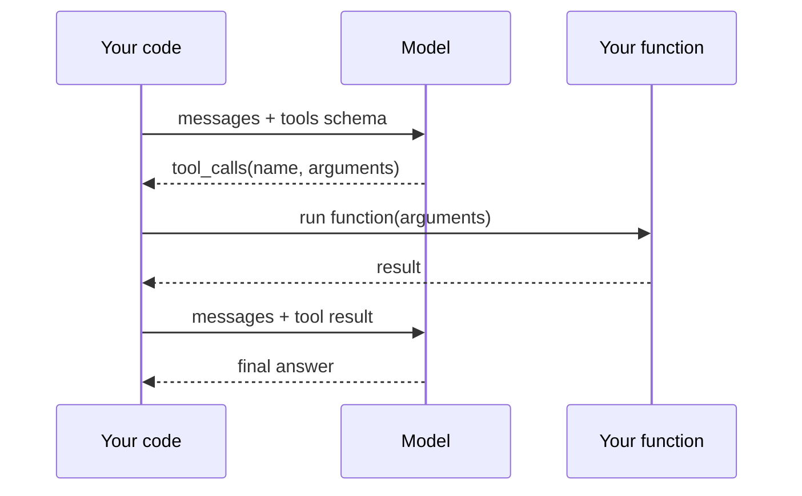

# 工具调用

LLM 可以请求你的程序运行一个函数，并把结果返回给它。模型看到你提供的工具 schema，自己判断什么时候调一下会有帮助，然后发出一个结构化的函数调用。你去执行这次调用，把结果喂回去，模型据此把回答补全。这让一次性问答变成了一个智能体循环 —— 是 [智能体工作流](../agents/index.md) 章节的基础。

## 流程



2——4 步可以重复 —— 模型可能在给出最终回复之前连续发起多次调用。

## 一个最小化的例子

一个工具，一次调用。模型不知道当前时间，所以必须问。

### 选择你的服务商

我们覆盖的三家服务商都使用 `openai` SDK；只有客户端和模型名不同。

=== "OpenAI"

    ```python
    from openai import OpenAI
    client = OpenAI(api_key=os.environ["OPENAI_API_KEY"])
    model = "gpt-4o-mini"
    ```

=== "DeepSeek"

    ```python
    from openai import OpenAI
    client = OpenAI(
        api_key=os.environ["DEEPSEEK_API_KEY"],
        base_url="https://api.deepseek.com",
    )
    model = "deepseek-chat"
    ```

=== "Qwen"

    ```python
    from openai import OpenAI
    client = OpenAI(
        api_key=os.environ["DASHSCOPE_API_KEY"],
        base_url="https://dashscope.aliyuncs.com/compatible-mode/v1",
    )
    model = "qwen-plus"
    ```

### 共用的工具调用代码

```python title="tool_use_minimal.py"
import json
import os
from datetime import datetime, timezone
from dotenv import load_dotenv

load_dotenv()
# client and model come from one of the tabs above


# 1. Define the actual Python function.
def get_current_time() -> str:
    return datetime.now(timezone.utc).isoformat()


TOOLS_BY_NAME = {"get_current_time": get_current_time}

# 2. Describe it to the model in JSON Schema.
TOOL_SCHEMAS = [
    {
        "type": "function",
        "function": {
            "name": "get_current_time",
            "description": "Get the current UTC time as an ISO-8601 string.",
            "parameters": {"type": "object", "properties": {}, "required": []},
        },
    },
]


def dispatch(tool_call) -> str:
    name = tool_call.function.name
    args = json.loads(tool_call.function.arguments or "{}")
    return str(TOOLS_BY_NAME[name](**args))


# 3. Run the conversation loop until the model stops asking for tools.
messages = [{"role": "user", "content": "What time is it right now?"}]

while True:
    resp = client.chat.completions.create(
        model=model,
        messages=messages,
        tools=TOOL_SCHEMAS,
    )
    msg = resp.choices[0].message
    messages.append(msg.model_dump(exclude_none=True))

    if not msg.tool_calls:
        break  # model is done — final answer is in msg.content

    for tc in msg.tool_calls:
        result = dispatch(tc)
        messages.append(
            {
                "role": "tool",
                "tool_call_id": tc.id,
                "content": result,
            }
        )

print(messages[-1]["content"])
```

预期输出（具体文字会有变化）：

```text
The current UTC time is 2026-04-20T23:14:07.582941+00:00.
```

## 模型看到与返回的内容

当模型决定调用一个工具时，assistant 消息里不会（或者不只会）带 `content`，而是会带 `tool_calls`：

```python
msg.tool_calls[0].id                   # "call_abc123"
msg.tool_calls[0].function.name        # "get_current_time"
msg.tool_calls[0].function.arguments   # JSON string of arguments
```

你需要回一条新的消息，`role: "tool"` 并且 `tool_call_id` 与上面那个对应上。`content` 可以是任意字符串 —— 一般就是结果，转成字符串或者 JSON 编码后的形式。

## 多个工具，任意参数

模式可以推广。再加一个函数、一条 schema，以及一行到 registry：

```python
def add(a: float, b: float) -> float:
    return a + b


TOOLS_BY_NAME["add"] = add

TOOL_SCHEMAS.append(
    {
        "type": "function",
        "function": {
            "name": "add",
            "description": "Add two numbers.",
            "parameters": {
                "type": "object",
                "properties": {
                    "a": {"type": "number", "description": "First addend."},
                    "b": {"type": "number", "description": "Second addend."},
                },
                "required": ["a", "b"],
            },
        },
    },
)
```

之后像 *"What is 17.3 + 5.9, and what time is it?"* 这样的提示会让模型在一条响应里同时发出 **两次** 工具调用。上面那段循环已经覆盖了这种情况 —— 会把 `msg.tool_calls` 里的每次调用都执行一遍，再把结果一起回传。

## 不同服务商之间的功能差异

我们覆盖的 OpenAI 兼容接口在工具调用上表现不一：

| 服务商 | 工具调用 | 并行调用 | 备注 |
|---|---|---|---|
| OpenAI   | 支持 | 支持 | 与上面的代码完全对齐。 |
| DeepSeek | 支持 | 支持 | 使用 `deepseek-chat`；推理模型的行为可能略有不同。 |
| Qwen     | 支持 | 视模型而定 | `qwen-plus` / `qwen-max` 支持；部分较旧或 turbo 版本不支持 —— 以模型文档为准。 |

经验法则：上面的 schema 格式在各服务商之间是一致的，但 **不要假设每个模型都能同样好地遵守工具调用约定**。如果某个较弱的模型完全不理工具，那就换一个更强的模型做 agent 相关的工作。

## 那些容易踩坑的地方

- **工具返回值必须转成字符串再追加回消息列表。** SDK 要求 tool 消息的 `content` 是 `str`；传进 dict 或数字会引发校验错误。
- **工具循环可能永远停不下来。** 在合到生产代码之前，用一个计数器卡住最大迭代数（`for _ in range(10): ...`） —— 模型出错时可能不停地重复调用工具。
- **参数是被解析过的 JSON 字符串，不是 Python dict。** `json.loads(tc.function.arguments or "{}")` 是标准写法。
- **同一轮里模型可能既返回 content 也返回 tool_calls。** 不要丢掉 `msg.content` —— 有些模型会在调用旁边 "边想边说"。
- **流式 + 工具调用** 使用不同的 chunk 结构（每次工具调用的增量分散在多个 chunk 里）。这里不展开；参考 [OpenAI 的流式工具调用文档](https://platform.openai.com/docs/guides/function-calling)。

## 下一步

- [智能体工作流](../agents/index.md) —— 把这个循环再扩展一步，加上记忆、规划、以及多个各有专长的智能体。
