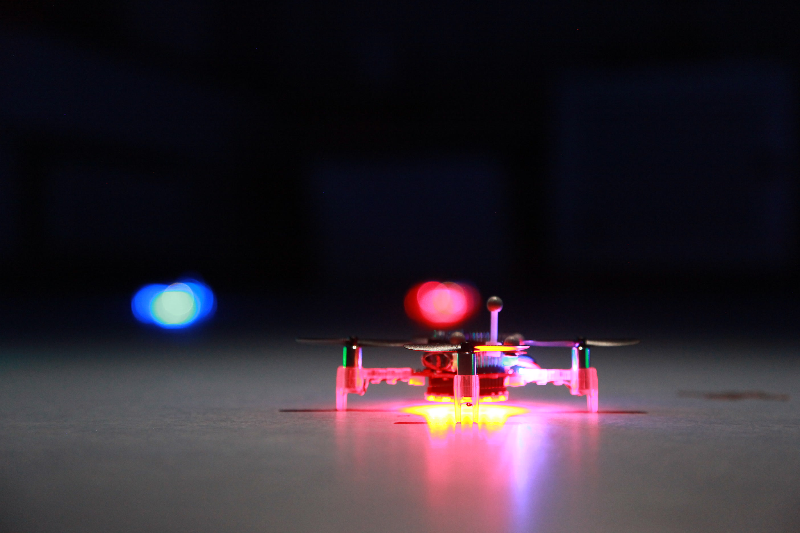
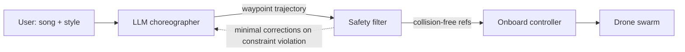
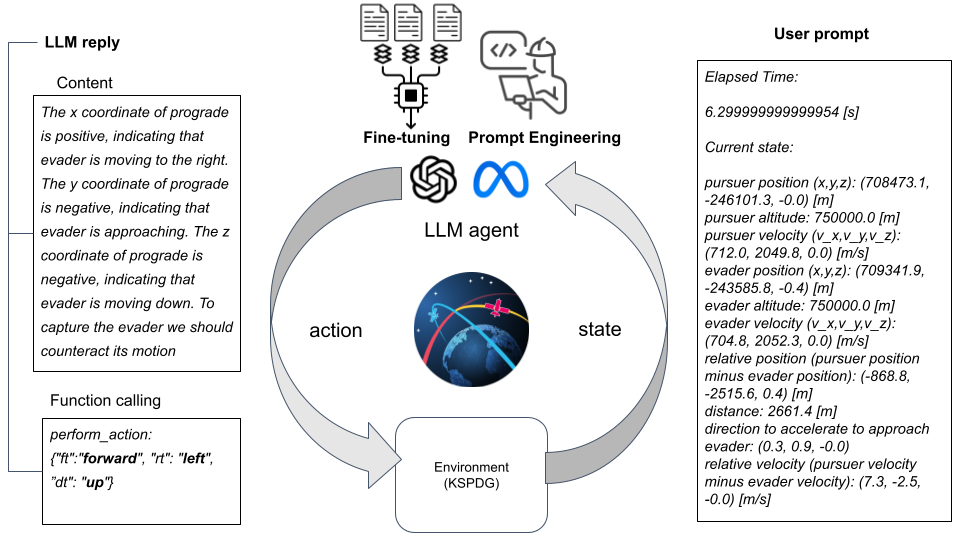
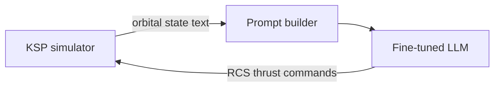
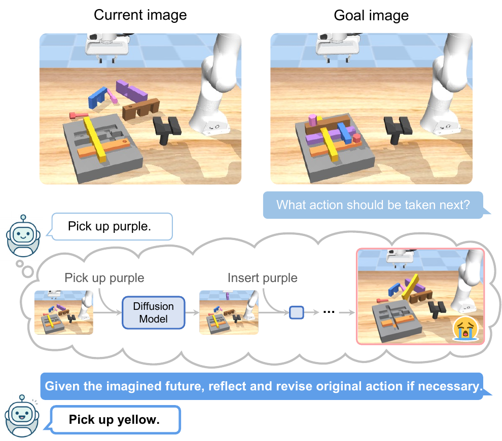
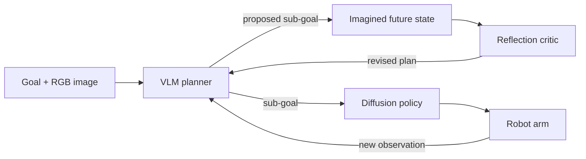

# LLM + Control in Real Applications

The earlier pages in this section worked on textbook problems — Laplace transforms, plot generation, a single PI tuning loop. Those are the right-size demos for *how the pieces fit*. This page is the other end: three real projects where an LLM sits somewhere in the control stack of a deployed robotic system. One drone swarm, one spacecraft, one manipulator. Each paper takes a different view of what the LLM is *for* — a planner, a controller, a reflective agent — and each diagram shows exactly where in the loop it lives.

## Drone swarm choreography — SwarmGPT

Drone swarm performances are synchronized aerial dances set to music: beautiful to watch, hard to design. A human choreographer has to get both the artistic intent *and* the low-level collision / actuator constraints right. SwarmGPT splits those jobs: an LLM handles the artistic layer, and a deterministic safety filter guarantees the trajectory is actually flyable.

{: style="max-width:640px;" }

**How the LLM fits**

The LLM proposes waypoint trajectories conditioned on the song and user intent. The safety filter makes **minimal corrections** — the smallest perturbations that restore feasibility — before the trajectory reaches the low-level controller. This is the tutorial's [Tool Use](../api/tool-use.md) pattern applied to robotics: the LLM is a creative proposer, a deterministic layer is the authority on what's physically allowed, and together they do what neither could alone.

**Result**

<video controls muted playsinline preload="metadata" style="max-width:640px; width:100%;">
  <source src="../assets/drone.mp4" type="video/mp4">
  Video not available in your browser.
</video>

Validated on simulations up to 200 drones and real flights with 20 drones, synchronized to diverse music.

**Paper**: [Tang et al., *SwarmGPT: Combining Large Language Models with Safe Motion Planning for Drone Swarm Choreography*, 2024](https://arxiv.org/abs/2412.08428)

## Autonomous spacecraft operations — KSPDG

The Kerbal Space Program Differential Games (KSPDG) is a public competition where teams build autonomous agents for **non-cooperative** spacecraft maneuvers — pursuit-evasion in orbit, for example. Classical approaches use optimal control or reinforcement learning. This work took a different bet: can an LLM, with the right prompt engineering and fine-tuning, operate a spacecraft directly?

{: style="max-width:640px;" }

**How the LLM fits**

The LLM is *inside* the control loop, not supervising it. Each cycle, the current orbital state is formatted as a text prompt, passed to a fine-tuned model, and the model's JSON-formatted output — thrust commands on the reaction-control system — is applied back to the simulator. The control policy is the LLM's learned weights. Three techniques combine to make this work: **prompt engineering** (what to tell the model each cycle), **few-shot prompting** (example trajectories in context), and **fine-tuning** (adapting the base model to the thrust-decision task).

**Result**

<video controls muted playsinline preload="metadata" style="max-width:640px; width:100%;">
  <source src="../assets/spacecraft.mp4" type="video/mp4">
  Video not available in your browser.
</video>

Ranked **2nd** in the KSPDG competition and is, to the authors' knowledge, the first LLM-based agent deployed for a space operations task.

**Paper**: [Carrasco et al., *Large Language Models as Autonomous Spacecraft Operators in Kerbal Space Program*, Advances in Space Research, 2025](https://doi.org/10.1016/j.asr.2025.06.034)

## Long-horizon robotic manipulation — Reflective Planning

Multi-stage manipulation — "assemble this part then screw it down then hand it over" — is where pretrained vision-language models (VLMs) *should* shine: they already know what the world looks like and what tools do. In practice they fail at long horizons because errors compound: a small misjudgment in step 2 becomes catastrophic by step 5. Reflective Planning addresses this not by training a bigger model but by adding a **reflection loop** at test time.

{: style="max-width:640px;" }

**How the LLM fits**

The novel piece is the `V → I → R → V` loop *before* anything touches the arm. The VLM proposes a sub-goal, a generative model imagines what the world would look like after executing it, and a reflection step critiques the imagined outcome. This lets the planner catch its own compounding errors before they reach the robot, using only a pretrained VLM and a generative imagination model — no additional RL training, no MCTS.

**Result**

<video controls muted playsinline preload="metadata" style="max-width:640px; width:100%;">
  <source src="../assets/manipulation.mp4" type="video/mp4">
  Video not available in your browser.
</video>

Outperforms state-of-the-art commercial VLMs and Monte Carlo Tree Search on long-horizon benchmark tasks.

**Paper**: [Jiang et al., *Reflective Planning: Vision-Language Models for Multi-Stage Long-Horizon Robotic Manipulation*, ICML 2025](https://arxiv.org/abs/2502.16707)

## The three roles at a glance

Each paper casts the LLM in a different part of the control stack — a useful taxonomy when you're thinking about where an LLM could live in your own system.

| Application | LLM role | Verification layer | How it relates to this tutorial |
|---|---|---|---|
| **SwarmGPT (drone)** | Supervisory planner — proposes trajectories from music + intent | External safety filter enforces feasibility | [Tool Use](../api/tool-use.md) pattern — LLM proposes, deterministic checker validates |
| **KSPDG (spacecraft)** | In-loop controller — fine-tuned model emits thrust commands directly | Baked into the learned weights via fine-tuning and few-shot examples | Same loop as [PID Tuning](pid.md), except the *controller itself* is the LLM, not a PI block |
| **Reflective Planning (manipulation)** | Reflective agent — imagines outcomes and critiques its own plan before acting | Self-supervised reflection against an imagined future state | [Agent loops](../agents/loops.md) and [Multi-agent](../agents/multi-agent.md) — writer/checker, but with a generative imagination model as the critic |

The shape repeats: wherever an LLM is in the loop, something deterministic — a safety filter, a physics simulator, an imagined outcome — has to close the loop back on it. That's the same lesson from the [PID Tuning](pid.md) page, just played out in three very different physical systems.

## Next

Back to the [LLM + Control overview](index.md).
