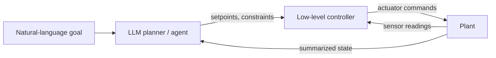

# LLM + Control

Capstone examples applying the LLM patterns from earlier sections to control-systems problems.

## Start here

_Coming soon._ Planned pages:

- **LLM as a high-level planner** — natural-language goals decomposed into setpoints for a classical controller (PID, LQR).
- **Anomaly explanation** — an agent that reads sensor logs, identifies out-of-spec behavior, and writes a human-readable report.
- **Agent-in-the-loop tuning** — a PID gain-tuning agent that reasons over step-response plots and iterates.

## The architecture we're aiming at

A rough sketch of how an LLM fits alongside a classical controller without replacing it:

The LLM operates at the **supervisory** layer — slow, high-level, interpretable — while the underlying controller handles tight, real-time loops it's already good at. That's the split we'll apply in every example here.
