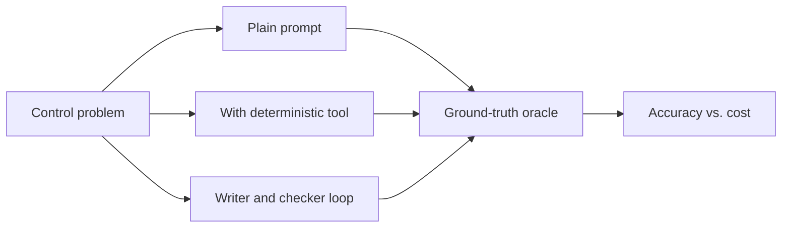

# LLM + Control

Apply the LLM patterns from earlier sections — plain prompting, tool use, and multi-agent loops — to concrete control-theory problems. The pages in this section walk through representative tasks in rough order of difficulty. Early problems (Laplace transforms) a capable model handles fine with a plain prompt; later problems (Routh–Hurwitz, Nyquist, PID tuning) force you up the staircase.

The goal isn't to replace SymPy or `python-control` with a language model — they're better at the math than any model is. The goal is to see, problem by problem, *where each layer of LLM machinery starts to become necessary*, and to build an intuition for when to reach for which tool.

## The staircase

Every page follows the same recipe: state the problem, pick a deterministic oracle for ground truth, run all three approaches, and compare.

Each rung reuses a pattern from earlier: plain prompting from [Calling the API](../api/index.md), deterministic tools from [Tool Use](../api/tool-use.md), and writer/checker from [Multi-agent](../agents/multi-agent.md). The staircase is the unifying story — every additional rung costs more tokens and more latency, but buys you something specific.

## Pages

- **[Laplace Transforms](laplace.md)** — Homework 2 Problem 3.3. A plain prompt already matches the textbook — we stop there, and save the tool + checker wiring for pages where it's actually needed.

Planned, each adding a new reason to climb the staircase:

- **Routh–Hurwitz stability** — plain-prompt accuracy starts to slip on higher-order characteristic polynomials.
- **Nyquist plots** — the tool now returns plots, not expressions; verification becomes a numerical check.
- **PID tuning from step-response data** — agent-in-the-loop with a `python-control` simulator; tools and loops become unavoidable.
