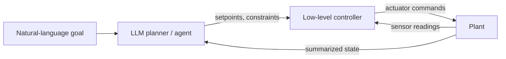

# LLM + 控制

把前面章节里的 LLM 模式应用到控制系统问题上的压轴例子。

## 从这里开始

*即将推出。* 计划中的页面：

- **LLM 作为高层规划器** —— 把自然语言目标分解成经典控制器（PID、LQR）的设定点。
- **异常解释** —— 一个读传感器日志、识别超出规范的行为、并写出人类可读报告的智能体。
- **智能体在环调参** —— 一个基于阶跃响应曲线推理并迭代的 PID 增益整定智能体。

## 我们瞄准的架构

LLM 如何与经典控制器配合，而不是取代它 —— 大致草图如下：

LLM 位于 **监督层** —— 慢、高层、可解释 —— 底层控制器继续负责它本就擅长的紧凑、实时循环。这正是我们在本章节每个例子里都会沿用的分工。
