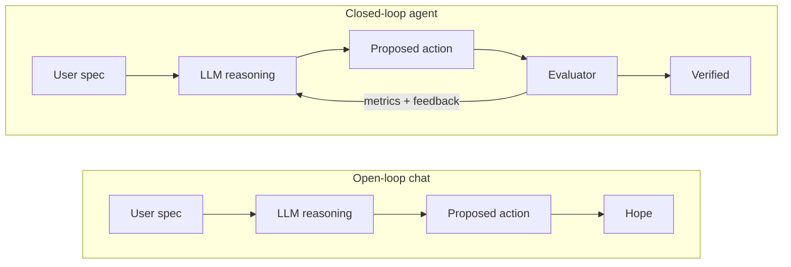
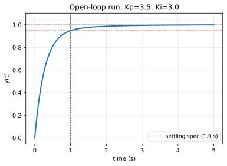
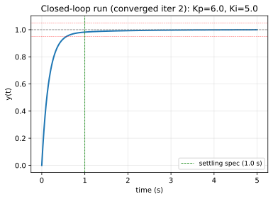

# PID Tuning

[](https://colab.research.google.com/github/MarkJH2001/LLM-Control-Tutorial/blob/main/notebooks/control_pid.ipynb)
[](https://deepnote.com/launch?url=https://github.com/MarkJH2001/LLM-Control-Tutorial/blob/main/notebooks/control_pid.ipynb)

Every controls student learns the difference between **open-loop** and **closed-loop** control on day one: without a sensor reading the output, a controller can only hope its command produced the right result; with a sensor closing the loop, the controller can measure the error and correct. That exact distinction applies to LLM workflows. A single chat turn is **open-loop** — you ask, the model answers, you find out later whether it was right. An agent with a deterministic evaluator in the loop is **closed-loop** — the model's proposal is measured against the spec and the result feeds back into the next turn.



This page turns that analogy into code. Same plant, same spec, same model — run once open-loop, run once with the evaluator in the loop, compare.

## The problem

Design a **PI controller** $K(s) = K_p + K_i/s$ for the first-order plant

$$
G(s) = \frac{1}{s + 1}
$$

so that the closed-loop step response meets:

- **settling time** ≤ 1 second (2 % criterion)
- **overshoot** ≤ 5 %
- **zero steady-state error** (the integral term handles this automatically when the loop is stable)

## The evaluator

Deterministic, `python-control`-backed. Given a candidate $(K_p, K_i)$, it builds the closed loop, checks stability, and reads settling time and overshoot off the step response.

```python
import numpy as np
import control as ctrl

SPECS = {"settling_time_max": 1.0, "overshoot_max": 5.0}


def evaluate_pi(kp: float, ki: float) -> dict:
    G = ctrl.TransferFunction([1], [1, 1])
    K = ctrl.TransferFunction([kp, ki], [1, 0])
    T = ctrl.feedback(K * G, 1)
    poles = ctrl.poles(T)
    stable = bool(np.all(np.real(poles) < 0))
    if not stable:
        return {"stable": False, "settling_time": None, "overshoot": None}
    info = ctrl.step_info(T)
    return {
        "stable": True,
        "settling_time": float(info["SettlingTime"]),
        "overshoot": float(info["Overshoot"]),
    }


def passes(perf: dict) -> bool:
    return (perf["stable"]
            and perf["settling_time"] <= SPECS["settling_time_max"]
            and perf["overshoot"] <= SPECS["overshoot_max"])
```

The evaluator is the **sensor**. The loop that pipes it back to the LLM is what makes the workflow closed-loop.

## Run A — open-loop chat

One LLM call. The model proposes $(K_p, K_i)$ in JSON; we parse and evaluate. No feedback path.

```python
SYSTEM_PROMPT = """You are a control-systems engineer. You are given a first-order plant
G(s) = 1 / (s + 1) and must design a PI controller K(s) = Kp + Ki/s that drives the
closed-loop step response to meet:

  - settling time <= 1 second (2% criterion)
  - overshoot <= 5%
  - zero steady-state error

Respond ONLY with JSON of the form {"kp": <number>, "ki": <number>}. No prose."""


resp = client.chat.completions.create(
    model=model,
    messages=[
        {"role": "system", "content": SYSTEM_PROMPT},
        {"role": "user",   "content": "Propose (Kp, Ki)."},
    ],
    response_format={"type": "json_object"},
    temperature=0,
)
kp, ki = json.loads(resp.choices[0].message.content).values()
perf = evaluate_pi(kp, ki)
print(f"Kp={kp}, Ki={ki} → {perf}, pass={passes(perf)}")
```

On `qwen-plus` (2026-04-21):

```text
LLM proposed:    Kp=3.5, Ki=3.0
Evaluator says:  stable=True, settling=1.609 s, overshoot=0.00%
Specs met?       False
```

{: style="max-width:500px;" }

The proposal is stable and has no overshoot — reasonable engineering intuition for a first try — but the settling time is **1.6 s against a 1 s spec**, so the design fails. Critically, a chat-style workflow has no way to know this. You only find out because we ran the evaluator *after the fact*. Inside the chat, the model has already handed you its answer and walked away.

## Run B — closed-loop agent

Same system prompt, same first proposal. The difference is the loop. After each attempt, the evaluator's verdict is fed back as a new user message, and the model reads it before proposing again.

```python
def feedback_msg(iter_num, kp, ki, perf):
    if not perf["stable"]:
        return f"Iteration {iter_num}: Kp={kp}, Ki={ki} is UNSTABLE. Propose new (Kp, Ki)."
    issues = []
    if perf["settling_time"] > SPECS["settling_time_max"]:
        issues.append(f"settling time {perf['settling_time']:.3f} s exceeds spec {SPECS['settling_time_max']} s")
    if perf["overshoot"] > SPECS["overshoot_max"]:
        issues.append(f"overshoot {perf['overshoot']:.2f}% exceeds spec {SPECS['overshoot_max']}%")
    return f"Iteration {iter_num}: Kp={kp}, Ki={ki} failed — {'; '.join(issues)}. Propose new (Kp, Ki) to fix this."


messages = [
    {"role": "system", "content": SYSTEM_PROMPT},
    {"role": "user",   "content": "Propose (Kp, Ki)."},
]

for i in range(1, 9):  # max 8 iterations
    resp = client.chat.completions.create(
        model=model, messages=messages,
        response_format={"type": "json_object"}, temperature=0,
    )
    raw = resp.choices[0].message.content
    kp, ki = json.loads(raw).values()
    perf = evaluate_pi(kp, ki)
    if passes(perf):
        break
    messages.append({"role": "assistant", "content": raw})
    messages.append({"role": "user",      "content": feedback_msg(i, kp, ki, perf)})
```

On `qwen-plus` (2026-04-21):

| Iter | $K_p$ | $K_i$ | Stable | Settling (s) | Overshoot (%) | Passes? |
|:---:|:---:|:---:|:---:|:---:|:---:|:---:|
| 1 | 3.5 | 3.0 | ✓ | 1.609 | 0.00 | ✗ |
| 2 | 6.0 | 5.0 | ✓ | 0.935 | 0.00 | ✓ |

{: style="max-width:500px;" }

Iteration 1 is the same proposal as Run A — same failure. In iteration 2 the model reads *"settling time 1.609 s exceeds spec 1 s"*, approximately doubles $K_p$ and bumps $K_i$ to match, and the new design passes. Two rounds, one evaluator call per round.

## Why this is the same shape as closed-loop control

Read the two mermaid diagrams again with a single mental substitution — replace *"LLM reasoning"* with *"controller"*, *"evaluator"* with *"sensor"*, and *"proposed action"* with *"control signal"*. You get the block diagrams from week one of every controls course. The engineering instinct that tells you "you can't hit a spec without feedback" applies unchanged to LLM workflows: without a deterministic measurement fed back into the next turn, you're doing open-loop guessing. With one — however lightweight — you have a closed loop that can correct.

The evaluator doesn't need to be sophisticated. Here it's ten lines of `python-control`. What matters is that it's **deterministic** and it **feeds its verdict back into the next model call**.

## Extending to other plants

The demo above uses a first-order stable plant, but the same agent pattern generalizes. The [ControlAgent](https://arxiv.org/abs/2410.19811) paper that this page is modelled on dispatches to six specialized sub-agents based on plant class:

| Plant class | Form | Notes |
|---|---|---|
| First-order stable | $G(s) = K/(\tau s + 1)$ | Covered in code above. |
| First-order unstable | $G(s) = K/(\tau s - 1)$ | Right-half-plane pole; the controller must first stabilize. |
| First-order with delay | $G(s) = K e^{-Ts}/(\tau s + 1)$ | Needs a Padé approximation inside the evaluator. |
| Second-order stable | $G(s) = K/(s^2 + 2\zeta\omega_n s + \omega_n^2)$ | Underdamped cases where overshoot is the real constraint. |
| Second-order unstable | $G(s) = K/(s^2 - as + b)$ | Combines stabilization and performance tuning. |
| Higher-order | Multi-pole / zero | Design memory matters — past iterations keep the agent from looping on bad regions. |

A **central agent** reads the user's plant and routes to the matching sub-agent. Each sub-agent runs the same propose → evaluate → feedback loop, just with the evaluator and the prompt specialised for its plant class. We keep this page's *code* to the first-order stable case so the core pattern stays clear; scaling out is a matter of adding sub-agents, not changing the shape of the loop.

## Takeaways

- **Chat is open-loop, agent is closed-loop.** The analogy isn't decoration — it's the whole argument for building agents instead of just prompting.
- **The evaluator is the sensor.** It can be a ten-line function and still turn a hopeful guess into a verified result.
- **Sub-agents scale, the loop doesn't change.** Different plant classes need different evaluators and different expert prompts; they don't need a different workflow shape.

## Next

Back to the [LLM + Control overview](index.md), or forward to [Real-World Applications](applications.md).
