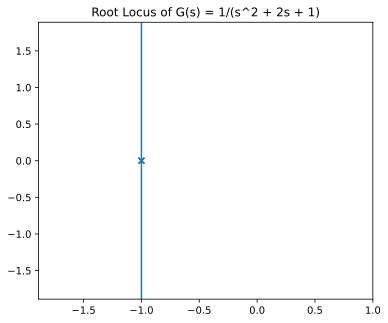
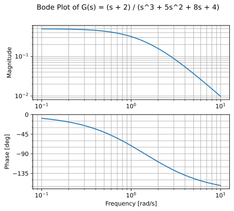
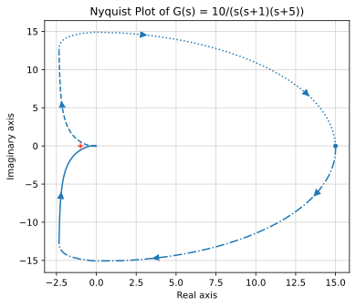

# Control Plots

[](https://colab.research.google.com/github/MarkJH2001/LLM-Control-Tutorial/blob/main/notebooks/control_plots.ipynb)
[](https://deepnote.com/launch?url=https://github.com/MarkJH2001/LLM-Control-Tutorial/blob/main/notebooks/control_plots.ipynb)

The first page in the LLM + Control section where a plain prompt no longer suffices. The model cannot generate a plot — it can only emit text. So we give it three tools backed by `python-control` (root locus, Bode, Nyquist) and let it parse a natural-language request into numerator/denominator coefficient lists and call the matching tool. The model's job shifts from "do the math" to **"translate the user's transfer function into tool inputs, then explain what the plot shows"**.

## The three tools

Each wraps a `python-control` routine, renders the figure inline, saves a PNG, and returns a short text confirmation the model can read. Root locus shown here in full — Bode and Nyquist are the same shape (see the [notebook](https://github.com/MarkJH2001/LLM-Control-Tutorial/blob/main/notebooks/control_plots.py) for all three).

```python
from pathlib import Path
import matplotlib.pyplot as plt
from control import root_locus, tf

PLOT_DIR = Path("plots")
PLOT_DIR.mkdir(exist_ok=True)


def plot_root_locus(numerator: list[float], denominator: list[float], title: str = "Root Locus") -> str:
    system = tf(numerator, denominator)
    fig, ax = plt.subplots(figsize=(6, 5))
    root_locus(system, ax=ax)
    ax.set_title(title)
    fig.savefig(PLOT_DIR / "root_locus.svg", bbox_inches="tight", dpi=120)
    plt.show()
    return f"Root locus rendered for numerator={numerator}, denominator={denominator}."
```

## The tool schemas

All three schemas are parallel — same `numerator` / `denominator` / `title` parameters, only the name and description differ. One factory function keeps things dry:

```python
def _schema(name: str, description: str) -> dict:
    return {
        "type": "function",
        "function": {
            "name": name,
            "description": description,
            "parameters": {
                "type": "object",
                "properties": {
                    "numerator":   {"type": "array", "items": {"type": "number"}},
                    "denominator": {"type": "array", "items": {"type": "number"}},
                    "title":       {"type": "string"},
                },
                "required": ["numerator", "denominator"],
            },
        },
    }


TOOL_SCHEMAS = [
    _schema("plot_root_locus", "Plot the root locus of a transfer function G(s) = N(s)/D(s)."),
    _schema("plot_bode",       "Plot the Bode magnitude and phase of a transfer function."),
    _schema("plot_nyquist",    "Plot the Nyquist diagram of a transfer function."),
]

TOOLS_BY_NAME = {
    "plot_root_locus": plot_root_locus,
    "plot_bode":       plot_bode,
    "plot_nyquist":    plot_nyquist,
}
```

## The agent loop

Same five-line loop as [Tool Use](../api/tool-use.md). Iterate `chat.completions.create(..., tools=TOOL_SCHEMAS)`, execute any tool calls the model returns, feed the results back, stop when the model answers without a tool call:

```python
import json

SYSTEM = (
    "You are a control-systems assistant with three plotting tools: "
    "plot_root_locus, plot_bode, and plot_nyquist. "
    "When the user gives you a transfer function G(s) = N(s)/D(s), "
    "parse N and D into polynomial coefficient lists in descending powers of s, "
    "then call the appropriate tool. "
    "After the tool runs, briefly describe what the plot shows."
)


def run_agent(user_message: str, max_steps: int = 5) -> str:
    messages = [
        {"role": "system", "content": SYSTEM},
        {"role": "user", "content": user_message},
    ]
    for _ in range(max_steps):
        resp = client.chat.completions.create(
            model=model,
            messages=messages,
            tools=TOOL_SCHEMAS,
            temperature=0,
        )
        msg = resp.choices[0].message
        messages.append(msg.model_dump(exclude_none=True))
        if not msg.tool_calls:
            return msg.content or ""
        for tc in msg.tool_calls:
            args = json.loads(tc.function.arguments or "{}")
            result = TOOLS_BY_NAME[tc.function.name](**args)
            messages.append({
                "role": "tool",
                "tool_call_id": tc.id,
                "content": result,
            })
    return messages[-1].get("content", "")
```

## Example 1 — Root locus

```python
run_agent("Plot the root locus of G(s) = 1 / (s^2 + 2s + 1).")
```

The model parses the transfer function and calls the tool:

```python
plot_root_locus(numerator=[1], denominator=[1, 2, 1])
```

{: style="max-width:500px;" }

??? example "Model's commentary — qwen-plus (2026-04-21)"

    The root locus plot shows how the closed-loop poles of the system \(G(s) = \frac{1}{s^2 + 2s + 1}\) move in the complex plane as the gain \(K\) varies from 0 to \(\infty\). Since the denominator is \((s+1)^2\), the open-loop system has a double pole at \(s = -1\). For \(G(s) = \frac{K}{(s+1)^2}\), the characteristic equation is \(s^2 + 2s + 1 + K = 0 \Rightarrow s^2 + 2s + (1+K) = 0\), whose roots are \(s = -1 \pm j\sqrt{K}\). So the locus is a vertical line at \(\sigma = -1\), extending upward and downward as \(K\) increases.

    This indicates the system remains stable for all \(K > 0\) (poles always have negative real part), but becomes increasingly underdamped with increasing \(K\).

## Example 2 — Bode plot

```python
run_agent("Draw the Bode plot of G(s) = (s + 2) / (s^3 + 5 s^2 + 8 s + 4).")
```

```python
plot_bode(numerator=[1, 2], denominator=[1, 5, 8, 4])
```

{: style="max-width:500px;" }

??? example "Model's commentary — qwen-plus (2026-04-21)"

    The Bode plot shows the frequency response of the transfer function \(G(s) = \frac{s + 2}{s^3 + 5s^2 + 8s + 4}\). It consists of two graphs:

    1. **Magnitude plot** — Shows the gain (in dB) versus frequency (log scale). The magnitude starts at approximately 6 dB at low frequencies and decreases at a rate of -40 dB/decade at high frequencies, indicating the system has three poles.
    2. **Phase plot** — Shows the phase shift (in degrees) versus frequency (log scale). The phase starts at 0° at low frequencies and approaches -90° at high frequencies, reflecting the dominant pole behavior.

    Since this is a third-order system with all poles in the left half-plane, the system is stable. Gain margin and phase margin can be read from where the magnitude crosses 0 dB and where the phase crosses -180°.

## Example 3 — Nyquist plot

```python
run_agent("Generate the Nyquist plot of G(s) = 10 / (s (s + 1) (s + 5)).")
```

Notice the denominator is given in **factored** form. The model has to expand $s(s+1)(s+5) = s^3 + 6s^2 + 5s$ before calling the tool — which it does, correctly:

```python
plot_nyquist(numerator=[10], denominator=[1, 6, 5, 0])
```

{: style="max-width:500px;" }

??? example "Model's commentary — qwen-plus (2026-04-21)"

    The Nyquist plot traces the path of \(G(j\omega)\) as \(\omega\) varies. For this third-order system with three poles (at \(s = 0\), \(s = -1\), and \(s = -5\)) and no zeros, the plot:

    - Starts at the origin (high-frequency gain goes to zero);
    - Ends at the origin (as \(\omega \to \infty\));
    - Approaches \(-270°\) of phase at high frequencies;
    - Crosses the negative real axis, which matters for stability via the Nyquist criterion.

    The plot helps determine closed-loop stability by examining how many times it encircles the critical point \((-1, 0)\).

## Takeaways

The division of labor is clean:

- **Model**: natural-language → coefficient lists (including polynomial expansion when the user gives factored form), tool selection from the instruction, post-hoc analysis of the plot.
- **Tool**: everything numerical — transfer-function construction, frequency sweep, singular-value decomposition, plotting.

Neither alone is sufficient. A plain prompt could produce a textbook-style *description* of a Bode plot but no actual plot. A raw `python-control` call needs explicit coefficients, which is exactly the tedious step the model is now doing for you. This is the first rung on the staircase where the LLM and a deterministic tool each bring something the other cannot.

## Next

Back to the [LLM + Control overview](index.md), or forward to [PID Tuning](pid.md).
