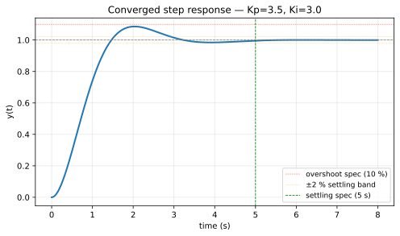

# Demo — End-to-End Worked Example

A complete, runnable, end-to-end example built on the [Beginner Template](beginner-template.md), so you can see exactly what a finished implementation looks like. The plant here is a textbook second-order system, **not the aircraft**. Once you've worked through this, swap the plant and specs for your chosen sub-option of the [Aircraft Attitude Control Agent](llm-agent.md) project and you're done.

The source files live at [`course-demo/`](https://github.com/MarkJH2001/LLM-Control-Tutorial/tree/main/course-demo) in the tutorial repo — clone the repo and follow the [run instructions](#run-it) below.

## What's in the demo

- **Plant**: $G(s) = \dfrac{1}{s^2 + 3s + 2}$.
- **Controller**: $G_c(s) = K_p + K_i / s$.
- **Default spec**: settling time $\le 5$ s, overshoot $\le 10\,\%$, rise time $\le 1$ s, zero step ess.
- **Backend**: SJTU API + `python-control` evaluator + agent loop, with the spec parameterized so the frontend can edit it at runtime.
- **Frontend**: Streamlit (default) and Gradio (alternative). Both ship every UI piece the [project page](llm-agent.md) requires:
    - description of the plant + controller form
    - **editable** settling-time / overshoot / rise-time targets
    - **Run agent** button
    - live iteration log
    - final step-response plot rendered as **SVG** for crisp resolution at any size
    - collapsible *Show system prompt* panel exposing the LLM's reasoning context

## `backend.py`

```python
"""Backend: SJTU client + python-control evaluator + PI agent loop.

Specs are passed in by the frontend so the user can edit them; the system prompt
holds the design intuition and the per-run target values are sent in the first
user message.
"""
import json
import os
import numpy as np
import control as ctrl
from dotenv import load_dotenv
from openai import OpenAI

load_dotenv()

client = OpenAI(
    api_key=os.environ["SJTU_API_KEY"],
    base_url="https://models.sjtu.edu.cn/api/v1",
)
MODEL = "deepseek-chat"


# ---------- Plant: G(s) = 1 / ((s+1)(s+2)) ----------
def build_plant() -> ctrl.TransferFunction:
    return ctrl.TransferFunction([1], [1, 3, 2])


G = build_plant()

DEFAULT_SPECS = {
    "settling_time_max": 5.0,    # seconds (2 % criterion)
    "overshoot_max":     10.0,   # %
    "rise_time_max":     1.0,    # seconds
}


def evaluate(gains: dict, specs: dict) -> dict:
    kp = float(gains.get("kp", 0))
    ki = float(gains.get("ki", 0))
    K = ctrl.TransferFunction([kp, ki], [1, 0])
    T = ctrl.feedback(K * G, 1)
    if not np.all(np.real(ctrl.poles(T)) < 0):
        return {"stable": False, "passes": False, "T": T,
                "settling_time": None, "overshoot": None, "rise_time": None}
    info = ctrl.step_info(T)
    perf = {
        "stable": True,
        "settling_time": float(info["SettlingTime"]),
        "overshoot": float(info["Overshoot"]),
        "rise_time": float(info["RiseTime"]),
        "T": T,
    }
    perf["passes"] = (perf["settling_time"] <= specs["settling_time_max"]
                      and perf["overshoot"]     <= specs["overshoot_max"]
                      and perf["rise_time"]     <= specs["rise_time_max"])
    return perf


def passes(perf: dict) -> bool:
    return bool(perf.get("passes"))


SYSTEM_PROMPT = """You are a control-systems engineer. Design a PI controller
G_c(s) = Kp + Ki/s for the plant G(s) = 1 / ((s+1)(s+2)).

The user will give you specific design targets in the first message; aim to
meet all of them. Step zero-steady-state-error is automatic with PI.

Design intuition:
  - Closed-loop polynomial is s^3 + 3 s^2 + (2 + Kp) s + Ki.
  - The PI zero is at s = -Ki/Kp. Place it near a plant pole (-1 or -2) to
    keep the integral mode FAST. Target Ki/Kp ~ 1-2.
  - Kp speeds the dominant complex pair: small -> slow rise; large -> overshoot.
  - WARNING: if Ki << Kp the integral pole drifts toward s = 0 and settling
    blows up even with no overshoot.

Respond ONLY with JSON {"kp": <number>, "ki": <number>}. No prose."""


def initial_user_msg(specs: dict) -> str:
    return (f"Design targets for this run:\n"
            f"  - settling time <= {specs['settling_time_max']} s\n"
            f"  - overshoot     <= {specs['overshoot_max']} %\n"
            f"  - rise time     <= {specs['rise_time_max']} s\n"
            f"  - zero step steady-state error\n"
            f"Propose initial (Kp, Ki).")


def feedback_msg(i: int, gains: dict, perf: dict, specs: dict) -> str:
    kp, ki = gains["kp"], gains["ki"]
    if not perf["stable"]:
        return f"Iter {i}: Kp={kp}, Ki={ki} is UNSTABLE. Reduce Ki and/or Kp."
    issues = []
    if perf["settling_time"] > specs["settling_time_max"]:
        if perf["overshoot"] < 3.0 and ki < kp:
            issues.append(f"settling={perf['settling_time']:.2f}s with little overshoot — "
                          f"the slow mode is the PI integral pole. INCREASE Ki toward Kp.")
        else:
            issues.append(f"settling={perf['settling_time']:.2f}s > {specs['settling_time_max']}s.")
    if perf["overshoot"] > specs["overshoot_max"]:
        issues.append(f"overshoot={perf['overshoot']:.2f}% > {specs['overshoot_max']}%; "
                      f"REDUCE Kp, keep Ki/Kp similar.")
    if perf["rise_time"] > specs["rise_time_max"]:
        issues.append(f"rise={perf['rise_time']:.3f}s > {specs['rise_time_max']}s; "
                      f"INCREASE Kp (and Ki proportionally).")
    return (f"Iter {i}: Kp={kp}, Ki={ki}. {'; '.join(issues)} "
            f"Hint: keep Ki/Kp around 1-2 so the PI zero stays near the slow plant pole.")


MAX_ITER = 8


def run_agent(specs: dict | None = None):
    """Generator. Yields one dict per iteration; the frontend renders these live."""
    specs = specs if specs is not None else DEFAULT_SPECS
    messages = [
        {"role": "system", "content": SYSTEM_PROMPT},
        {"role": "user", "content": initial_user_msg(specs)},
    ]
    for i in range(1, MAX_ITER + 1):
        resp = client.chat.completions.create(
            model=MODEL, messages=messages,
            response_format={"type": "json_object"}, temperature=0,
        )
        raw = resp.choices[0].message.content
        gains = json.loads(raw)
        perf = evaluate(gains, specs)
        yield {"iter": i, "gains": gains, "perf": perf, "raw": raw, "specs": specs}
        if passes(perf):
            return
        messages.append({"role": "assistant", "content": raw})
        messages.append({"role": "user", "content": feedback_msg(i, gains, perf, specs)})


def step_plot_svg(T, gains: dict, specs: dict) -> str:
    """Render the step response as an SVG string, ready to embed in either UI."""
    import io
    import matplotlib.pyplot as plt
    t = np.linspace(0, 8, 800)
    t_out, y_out = ctrl.step_response(T, T=t)
    fig, ax = plt.subplots(figsize=(7, 4))
    ax.plot(t_out, y_out, lw=2)
    ax.axhline(1.0, ls="--", color="gray", lw=0.8)
    ax.axhline(1.0 + specs["overshoot_max"] / 100, ls=":", color="red", lw=0.7,
               label=f"overshoot spec ({specs['overshoot_max']:.0f} %)")
    ax.axvline(specs["settling_time_max"], ls="--", color="green", lw=0.8,
               label=f"settling spec ({specs['settling_time_max']:.1f} s)")
    ax.set_xlabel("time (s)"); ax.set_ylabel("y(t)")
    ax.set_title(f"Converged step response — Kp={gains['kp']}, Ki={gains['ki']}")
    ax.legend(loc="lower right", fontsize=9); ax.grid(True, alpha=0.3)
    buf = io.StringIO()
    fig.savefig(buf, format="svg", bbox_inches="tight")
    plt.close(fig)
    return buf.getvalue()
```

## `app_streamlit.py` (default)

```python
"""Streamlit frontend. Run: streamlit run app_streamlit.py"""
import streamlit as st

from backend import (DEFAULT_SPECS, MAX_ITER, SYSTEM_PROMPT,
                     passes, run_agent, step_plot_svg)

st.set_page_config(page_title="Course Project Demo", layout="wide")
st.title("Course Project Demo")

st.markdown(r"""
**Plant**: $G(s) = \dfrac{1}{(s+1)(s+2)}$ — two real poles at $s = -1, -2$.

**Controller**: PI, $G_c(s) = K_p + K_i / s$.

**Goal**: design $K_p$ and $K_i$ so the unit-feedback closed-loop step response
hits the targets below. An LLM agent proposes gains, a `python-control`
evaluator scores them, and the loop iterates until every spec passes.
""")

st.subheader("Design targets")
col1, col2, col3 = st.columns(3)
with col1:
    settling_max = st.number_input("Settling time max (s)",
                                   value=DEFAULT_SPECS["settling_time_max"],
                                   min_value=0.1, step=0.5, format="%.2f")
with col2:
    overshoot_max = st.number_input("Overshoot max (%)",
                                    value=DEFAULT_SPECS["overshoot_max"],
                                    min_value=0.0, step=1.0, format="%.2f")
with col3:
    rise_max = st.number_input("Rise time max (s)",
                               value=DEFAULT_SPECS["rise_time_max"],
                               min_value=0.05, step=0.1, format="%.2f")

specs = {"settling_time_max": float(settling_max),
         "overshoot_max":     float(overshoot_max),
         "rise_time_max":     float(rise_max)}

with st.expander("Show system prompt (LLM reasoning context)"):
    st.code(SYSTEM_PROMPT, language="text")

if st.button("Run agent", type="primary"):
    log_placeholder = st.empty()
    log_lines, converged_step = [], None
    for step in run_agent(specs):
        i, g, p = step["iter"], step["gains"], step["perf"]
        log_lines.append(f"Iter {i}: Kp={g['kp']}, Ki={g['ki']} → "
                         f"settling={p['settling_time']!s:<8s} ovr={p['overshoot']!s:<7s} "
                         f"rise={p['rise_time']!s:<8s} pass={p['passes']}")
        log_placeholder.code("\n".join(log_lines))
        if passes(p):
            converged_step = step
            st.success(f"Converged at iteration {i}.")
            break
    if converged_step is None:
        st.error(f"Did not converge within {MAX_ITER} iterations.")
    else:
        svg = step_plot_svg(converged_step["perf"]["T"],
                            converged_step["gains"], specs)
        st.markdown(f'<div style="max-width:760px;margin:auto">{svg}</div>',
                    unsafe_allow_html=True)
```

## `app_gradio.py` (alternative)

```python
"""Gradio frontend. Run: python app_gradio.py"""
import gradio as gr

from backend import (DEFAULT_SPECS, MAX_ITER, SYSTEM_PROMPT,
                     passes, run_agent, step_plot_svg)


def run_with_specs(settling_max, overshoot_max, rise_max):
    specs = {"settling_time_max": float(settling_max),
             "overshoot_max":     float(overshoot_max),
             "rise_time_max":     float(rise_max)}
    log, final_svg = [], ""
    for step in run_agent(specs):
        i, g, p = step["iter"], step["gains"], step["perf"]
        log.append(f"Iter {i}: Kp={g['kp']}, Ki={g['ki']} → "
                   f"settling={p['settling_time']!s:<8s} ovr={p['overshoot']!s:<7s} "
                   f"rise={p['rise_time']!s:<8s} pass={p['passes']}")
        if passes(p):
            log.append(f"\nConverged at iteration {i}.")
            final_svg = (f'<div style="max-width:760px;margin:auto">'
                         f'{step_plot_svg(p["T"], g, specs)}</div>')
            break
    else:
        log.append(f"\nDid not converge within {MAX_ITER} iterations.")
    return "\n".join(log), final_svg


with gr.Blocks(title="Course Project Demo") as iface:
    gr.Markdown("# Course Project Demo")
    gr.Markdown(
        r"""
**Plant**: $G(s) = \dfrac{1}{(s+1)(s+2)}$ — two real poles at $s = -1, -2$.

**Controller**: PI, $G_c(s) = K_p + K_i / s$.

**Goal**: design $K_p$ and $K_i$ so the unit-feedback closed-loop step response
hits the targets below. An LLM agent proposes gains, a `python-control`
evaluator scores them, and the loop iterates until every spec passes.
""",
        latex_delimiters=[{"left": "$", "right": "$", "display": False}],
    )

    gr.Markdown("### Design targets")
    with gr.Row():
        settling_in = gr.Number(label="Settling time max (s)",
                                value=DEFAULT_SPECS["settling_time_max"])
        overshoot_in = gr.Number(label="Overshoot max (%)",
                                 value=DEFAULT_SPECS["overshoot_max"])
        rise_in = gr.Number(label="Rise time max (s)",
                            value=DEFAULT_SPECS["rise_time_max"])

    with gr.Accordion("Show system prompt (LLM reasoning context)", open=False):
        gr.Textbox(value=SYSTEM_PROMPT, lines=18, interactive=False, show_label=False)

    run_btn = gr.Button("Run agent", variant="primary")
    log_out = gr.Textbox(label="Iteration log", lines=12)
    plot_out = gr.HTML(label="Step response")

    run_btn.click(fn=run_with_specs,
                  inputs=[settling_in, overshoot_in, rise_in],
                  outputs=[log_out, plot_out])


if __name__ == "__main__":
    iface.launch()
```

## What converges

A real run against SJTU `deepseek-chat` (default targets, 2026-05-05):

```text
Iter 1: Kp=3.0, Ki=2.5 → settling=3.04 s  ovr=4.86 %  rise=1.11 s  pass=False
Iter 2: Kp=4.0, Ki=3.5 → settling=3.84 s  ovr=11.90 % rise=0.92 s  pass=False
Iter 3: Kp=3.5, Ki=3.0 → settling=2.95 s  ovr=8.59 %  rise=0.96 s  pass=True
```

The trajectory is the typical PI-tuning two-step:

- **Iter 1** — first guess sits in the right neighborhood, but rise time misses (1.11 s vs 1 s spec). The feedback says *"increase Kp to speed it up"*.
- **Iter 2** — model bumps Kp from 3 → 4. Rise time now passes, but the closed loop is now too underdamped — overshoot jumps to 11.9 % and breaks the spec. Feedback says *"reduce Kp, keep Ki/Kp similar"*.
- **Iter 3** — model bisects to Kp = 3.5, Ki = 3.0. All three time-domain specs pass.

Converged step response:

{: style="max-width:640px;" }

Three iterations, three API calls, three evaluator runs. The agent loop is doing exactly what a human would do at the controls bench, just faster. Tighten the targets in the spec block and the convergence path changes — try it.

## Run it

Clone the repo and run from the [`course-demo/`](https://github.com/MarkJH2001/LLM-Control-Tutorial/tree/main/course-demo) folder:

```bash
git clone https://github.com/MarkJH2001/LLM-Control-Tutorial.git
cd LLM-Control-Tutorial/course-demo

python -m venv venv
source venv/bin/activate                    # macOS / Linux
# venv\Scripts\activate                      # Windows

pip install -r requirements.txt
cp .env.example .env                         # then edit .env: SJTU_API_KEY=sk-...

streamlit run app_streamlit.py               # default — opens http://localhost:8501
# or:
python app_gradio.py                          # alternative — opens http://127.0.0.1:7860
```

Click **Run agent** (Streamlit) or **Submit** (Gradio) and watch the iteration log fill in. SJTU API access requires the campus network or VPN.

## How to adapt this for the aircraft project

The demo is a template, not the answer. To turn it into your real submission:

1. **Replace `build_plant()`** with the aircraft attitude-control plant from Figure 2 of the [project page](llm-agent.md). Compute the open-loop $G(s)$ once symbolically (paper or `sympy`) and hard-code its numerator and denominator coefficients.
2. **Replace `DEFAULT_SPECS`** with the targets for whichever sub-option (a)–(d) you picked. Add an `ess_accel_max` entry for (b)–(d) and an `ess_ramp_max` for (a).
3. **Extend `evaluate()`** with the steady-state-error computation for your sub-option (use the velocity / acceleration error constants $K_v, K_a$ from the open-loop transfer function).
4. **Rewrite `SYSTEM_PROMPT` and `feedback_msg`** with the design intuition specific to the aircraft plant — what each gain does on a third-order plant, how the inner motor loop interacts with PI, etc. (See the *"Where your control-theory knowledge goes"* section on the [project page](llm-agent.md).)
5. **For sub-option (d)**, swap the time-domain `step_info` checks for frequency-domain `margin` and `bandwidth`; render Bode instead of step response in `step_plot_svg`.

Everything else — the SJTU client, the agent loop, the spec-input widgets, the SVG rendering — stays the same.
