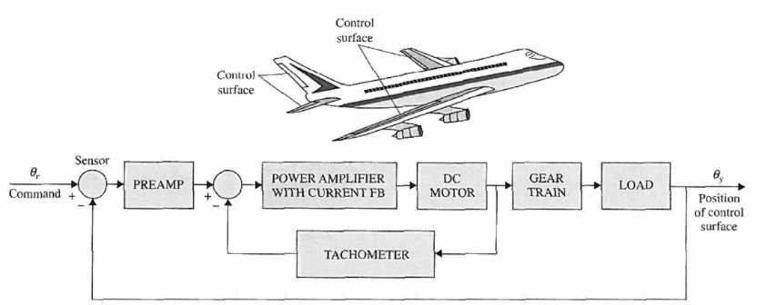
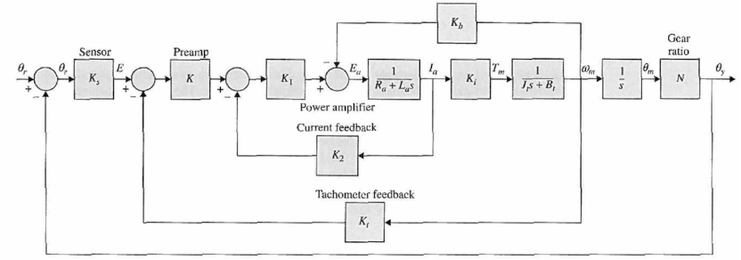

# Aircraft Attitude Control Agent

Build an LLM agent for **PID controller design and tuning** on an aircraft attitude-control plant: the agent proposes gains, evaluates them against the performance requirements, and iterates until the specs are met. You build two halves — a Python **backend** that runs the agent loop against a `python-control` evaluator, and a small **frontend** UI built with [Streamlit](https://streamlit.io/) or [Gradio](https://www.gradio.app/) that exposes the agent. The plant, parameters, and specs are below. **Pick one of the four design problems in question (2)** to focus on.

!!! info "Where your control-theory knowledge goes"
    The loop scaffolding — call the API, parse JSON, evaluate, feed the result back — is the same in every iteration; you only write it once. What makes the agent actually solve the problem is **how you communicate your control-theory understanding to the model**, in two places:

    - **System prompt** — the plant (the transfer function from Figure 2), the controller form, and the design spec, plus the kind of intuition you'd give a junior engineer: how $K_p$, $K_i$, $K_d$ each move rise time, overshoot, steady-state error, and phase margin.
    - **Failure-feedback message** — after a proposal misses, don't just print the numbers. Point in the direction your training suggests (e.g. *"settling too slow with no overshoot → raise $K_p$"*).

    This isn't "prompt engineering" in the tweaks-and-tricks sense — it's a thin text interface where the controls knowledge from your class meets the model. The clearer that knowledge gets expressed, the fewer iterations the agent needs.

## System description

Consider a modern aircraft (Figure 1). The purpose of the aircraft considered here is to control the positions of the fins. Due to the requirements of improved reliability and response, the surfaces of modern aircraft are controlled by electric actuators with electronic controls.

Figure 1 illustrates the controlled surfaces and the block diagram of one axis of such a position-control system. Figure 2 shows the transfer function block diagram of the system. The system is simplified to the extent that saturation of the amplifier gain and motor torque, gear backlash, and shaft compliances have all been neglected. The objective of the system is to have the output, $\theta_y(t)$, follow the input, $\theta_r(t)$.

{: style="max-width:720px;" }

**Figure 1**: Block diagram of an attitude control system of an aircraft.

{: style="max-width:720px;" }

**Figure 2**: Transfer function block diagram of the aircraft attitude control system.

## System parameters

The following system parameters are given initially:

| Parameter | Symbol | Value |
|---|---|---|
| Gain of encoder | $K_s$ | $1\;\mathrm{V/rad}$ |
| Gain of preamplifier | $K$ | $\mathrm{adjustable}$ |
| Gain of power amplifier | $K_1$ | $10\;\mathrm{V/V}$ |
| Gain of current feedback | $K_2$ | $0.5\;\mathrm{V/A}$ |
| Gain of tachometer feedback | $K_t$ | $0\;\mathrm{V/(rad/s)}$ |
| Armature resistance of motor | $R_a$ | $5.0\;\Omega$ |
| Armature inductance of motor | $L_a$ | $0.003\;\mathrm{H}$ |
| Torque constant of motor | $K_i$ | $9.0\;\mathrm{N \cdot m/A}$ |
| Back-EMF constant of motor | $K_b$ | $0.0636\;\mathrm{V/rad/s}$ |
| Inertia of motor rotor | $J_m$ | $0.0001\;\mathrm{kg \cdot m^2}$ |
| Inertia of load | $J_L$ | $0.01\;\mathrm{kg \cdot m^2}$ |
| Viscous-friction coefficient of motor | $B_m$ | $0.005\;\mathrm{N \cdot m \cdot s}$ |
| Viscous-friction coefficient of load | $B_L$ | $1.0\;\mathrm{N \cdot m \cdot s}$ |
| Gear-train ratio between motor and load | $N = \theta_y / \theta_m$ | $1/10$ |

Because the motor shaft is coupled to the load through a gear train with ratio $N$, $\theta_y = N\theta_m$, the total inertia and viscous-friction coefficient seen by the motor are
$$
J_t = J_m + N^2 J_L, \qquad B_t = B_m + N^2 B_L,
$$
and the gain of preamplifier is set to $K = 181.17$.

## Questions

### (1) Simulation and analysis

Simulate the proposed control system with MATLAB/Simulink/Python, and analyze the stability and performance of the system.

### (2) Controller design — pick one

Build an LLM agent to design and tune a controller meeting **one** of the four sets of performance requirements below. Pick the sub-problem you want to focus on.

**(a) PD controller, time-domain specs.** Suppose a PD controller $G_c(s) = K_P + K_D s$ with $K_P = 1$ is applied. If different $K_D$ is selected, analyze performance of the control system **by using an LLM agent** and determine whether the following time-domain performance specifications can be satisfied:

- Steady-state error due to unit-ramp input $\le 0.000443$
- Maximum overshoot $\le 5\%$
- Rise time $t_r \le 0.005\;\mathrm{sec}$
- Setting time $t_s \le 0.005\;\mathrm{sec}$

**(b) PI controller, time-domain specs.** Suppose a PI controller $G_c(s) = K_P + \dfrac{K_I}{s}$ is applied. Determine $K_P$ and $K_I$ **by using an LLM agent** to satisfy the following time-domain performance specifications:

- Steady-state error due to acceleration input $\le 0.2$ (acceleration input is $\frac{1}{2}t^2$)
- Maximum overshoot $\le 5\%$
- Rise time $t_r \le 0.01\;\mathrm{sec}$
- Setting time $t_s \le 0.02\;\mathrm{sec}$

**(c) PID controller, time-domain specs.** Suppose a PID controller $G_c(s) = K_P + K_D s + \dfrac{K_I}{s}$. Determine $K_P$, $K_I$ and $K_D$ **by using an LLM agent** to satisfy the following time-domain performance specifications:

- Steady-state error due to acceleration input $\le 0.2$ (acceleration input is $\frac{1}{2}t^2$)
- Maximum overshoot $\le 5\%$
- Rise time $t_r \le 0.005\;\mathrm{sec}$
- Setting time $t_s \le 0.005\;\mathrm{sec}$

**(d) PID controller, frequency-domain specs.** Determine $K_P$, $K_I$ and $K_D$ **by using an LLM agent** to satisfy the following frequency-domain performance specifications:

- Steady-state error due to acceleration input $\le 0.2$ (acceleration input is $\frac{1}{2}t^2$)
- Phase margin $\ge 70°$
- Resonant peak $M_r \le 1.1$
- Bandwidth $BW \ge 1000\;\mathrm{rad/sec}$

### (3) State-space model and state-feedback controller

Establish state-space model of the aircraft attitude control model and design a state feedback controller to improve the performance. Simulate the proposed control system with stability and performance analysis.

### (4) Robustness

For the design in (2) and (3), when parameter uncertainty and modeling error are taken into account, simulate the proposed system and analyze its performance. Moreover, propose robust method to reduce the performance influences of parameter uncertainty and modeling error, and simulate the proposed robust method with Matlab/Simulink/Python.

!!! note
    For problems (3) and (4), the classical methods you learned in class are the default approach. Extending your LLM agent to tackle them is a welcome alternative, but not required.

## What to build

You deliver two halves stitched together.

**Backend** (Python). An agent loop on top of the SJTU API. Each iteration:

1. The LLM proposes controller gains in a structured format (e.g. JSON with `kp`, `ki`, `kd`).
2. A `python-control`-based evaluator builds the closed loop with the aircraft plant from Figure 2 and checks every spec for the sub-problem you picked (`step_info` for time-domain options (a)–(c), `margin` and `bandwidth` for frequency-domain option (d)).
3. The evaluator's verdict — pass/fail per spec, plus the actual numerical metrics — is fed back to the model as the next user message.
4. The loop terminates on convergence or an iteration cap (e.g. 10).

!!! tip "Why JSON?"
    [JSON](https://www.json.org/) (JavaScript Object Notation) is a small, human-readable text format for structured data — essentially Python `dict`s and lists with quotes. Asking the model to reply in JSON (most OpenAI-compatible APIs support `response_format={"type": "json_object"}`) means you can `json.loads(...)` the response straight into a Python dict and pull out `kp`, `ki`, `kd` as numbers — no regex, no markdown stripping, no prose parsing. That's what makes the propose → evaluate → feedback loop reliable across iterations.

!!! tip "Why python-control?"
    [`python-control`](https://python-control.readthedocs.io/) is the Python counterpart to MATLAB's Control System Toolbox: it provides `TransferFunction`, `feedback`, `step_response`, `step_info`, `margin`, `bandwidth`, `bode`, `nyquist`, `root_locus`, and the rest of the classical-control API in one library. For this project the evaluator is just a few lines — build the aircraft plant from Figure 2, close the loop with the proposed controller, then read settling time / overshoot from `step_info(...)` for sub-options (a)–(c), or phase margin / bandwidth from `margin(...)` and `bandwidth(...)` for sub-option (d).

    See the [PID Tuning](../control/pid.md) page for a working `python-control` evaluator you can copy from.

The agent-loop pattern is the same one introduced in [PID Tuning](../control/pid.md); reuse it. For tool-calling and JSON-mode mechanics see [Tool Use](../api/tool-use.md). For multi-agent variants (writer / checker) see [Multi-agent](../agents/multi-agent.md).

**Frontend** ([Streamlit](https://streamlit.io/) *or* [Gradio](https://www.gradio.app/)). A small UI on top of the backend.

!!! tip "Why Streamlit or Gradio?"
    Both are Python libraries that turn a single script into a small web app with a few function calls — no HTML, no JavaScript, no separate frontend project. [**Streamlit**](https://streamlit.io/) is laid out top-to-bottom like a notebook and shines for dashboards with widgets and live-updating output. [**Gradio**](https://www.gradio.app/) is built around `Interface(fn, inputs, outputs)` and was designed for quick ML / model demos. Either is plenty for this project; pick whichever feels more natural.

    Other frontends are fine too — Flask + a template, FastAPI + a small React page, even a Jupyter notebook with `ipywidgets`. The only constraint is that the user can pick a sub-option, edit the spec, hit **Run**, and watch the agent iterate.

At minimum the UI should provide:

- A description of the problem chosen (controller form and the spec being targeted)
- An editable spec block (so the user can tighten or relax targets)
- A **Run** button that triggers the agent
- A live iteration log: each row shows the proposed gains and the evaluator's verdict
- A final plot — step response for (a)–(c), Bode plot for (d)
- (Optional) a collapsible panel showing the LLM's reasoning / system prompt

## Deliverables

- Source code for backend and frontend (single repo or zip).
- A short demo: screencast or screenshots of the running app converging on at least one design.
- The full agent transcript for that converged run (every iteration's proposal + evaluator verdict).
- A brief writeup (~1 page) comparing the agent's final gains to a hand-tuned baseline you trust, and noting where the agent struggled.
