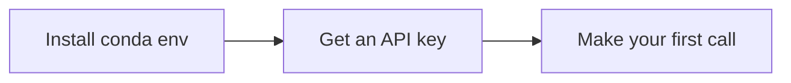

# Getting Started

This section walks you through the one-time setup every other part of the tutorial assumes: a Python environment and a provider API key.

## Start here

- [Setup](setup.md) — create the `llm-tutorial` conda env and install dependencies.
- [API Keys](api-keys.md) — obtain a key from one of the three providers we cover and store it safely.

## The onboarding flow

Three steps, in order — each page builds on the previous one:

When you can run the "hello world" snippet from [First Call](../api/first-call.md), the rest of the tutorial is open to you.
