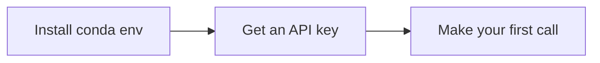

# 开始入门

本章节介绍本教程其余部分都依赖的一次性环境配置：一个 Python 环境和一把服务商 API 密钥。

## 从这里开始

- [环境配置](setup.md) —— 创建 `llm-tutorial` 的 conda 环境并安装依赖。
- [API 密钥](api-keys.md) —— 从我们覆盖的三家服务商中任取一家申请密钥，并妥善保存。

## 入门流程

三步，按顺序进行 —— 每一页都建立在前一页之上：

当你能跑通 [首次调用](../api/first-call.md) 中的 "hello world" 代码片段时，本教程的其余部分就对你全部开放了。
