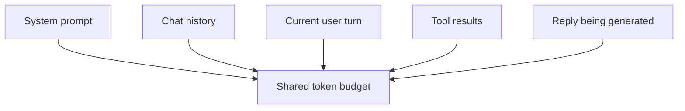

# Context Window

The context window is the **maximum number of tokens the model can attend to in one call** — *input plus output, combined*. Everything in your prompt, any prior conversation turns, any tool results, and the tokens the model generates in reply all count against the same budget.

## What shares the budget

Everything in a single call draws from the same token pool:

The actual split between these categories depends entirely on your application — a RAG app is mostly tool results, a chatbot is mostly history, a one-shot query is mostly reply. There is no universal "correct" allocation.

When you hit the limit:

- The provider returns an HTTP 400 with `context_length_exceeded` (or a similarly named code).
- Or the reply is truncated mid-sentence with `finish_reason: "length"` — that happens when input fits, but you didn't leave enough headroom for the full answer. Bump `max_tokens` or shorten the prompt.

## Typical limits

Moving target — verify on each provider's model catalog. Order of magnitude as of April 2026:

| Model family | Context window |
|---|---|
| `gpt-4o` / `gpt-4o-mini` | 128k tokens |
| `gpt-4.1` | 1M tokens |
| `deepseek-chat` | 64k tokens |
| `qwen-plus` / `qwen-max` | 128k – 1M tokens (depends on variant) |

## Why "bigger context" isn't free

Three costs scale with context length:

1. **Price.** You pay per input token. A 500k-token prompt is roughly 500× the cost of a 1k-token prompt for the same question.
2. **Latency.** Attention over long contexts is slower; first-token latency on a million-token prompt can run into several seconds.
3. **Quality.** Models demonstrably retrieve less well from the middle of long contexts than from the ends — the so-called "lost in the middle" effect. More data is not always more useful.

## Managing context in agent loops

In a multi-turn loop (see [Tool Use](../api/tool-use.md) and the Agentic Workflows section), context grows every turn. Three practical strategies:

- **Summarize old turns.** After *N* turns, ask the model to condense the history into a short summary; keep the summary, drop the raw turns.
- **Truncate tool output.** Large file contents, API responses, or search results — keep a bounded slice (first few KB, or only the fields you'll need downstream).
- **Separate reasoning from state.** Store durable state outside the context (a small DB or file), and include only what's relevant to the current turn.

Leave headroom. Targeting **50–70% of the limit** is safer than packing to the ceiling — you need room for the reply, for any tool outputs, and to avoid the "lost in the middle" degradation.

## Next

- [Tool Use](../api/tool-use.md) — tool results consume context every turn.
