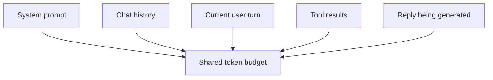

# 上下文窗口

上下文窗口是 **一次调用中模型能够关注的最大词元数** —— *输入加输出，合在一起计算*。你提示中的全部内容、任何此前的对话轮次、任何工具返回的结果，以及模型正在生成的回复 —— 全都占用同一份预算。

## 谁在共享这份预算

一次调用里的一切都从同一个词元池里取：

这几类之间的实际比例，完全取决于你的应用 —— RAG 应用大部分是工具结果，聊天机器人大部分是历史，一次性问答大部分是回复。这里并没有一个普适的 "正确" 分配。

触达上限时：

- 服务商会返回一个 HTTP 400，错误码是 `context_length_exceeded`（或类似命名）。
- 或者回复在中途被截断，`finish_reason: "length"` —— 输入还塞得下，但你没给完整答复留下足够余量时就会发生。把 `max_tokens` 调大，或者缩短提示。

## 典型上限

这是一个随时间变化的目标 —— 请以各家服务商的模型目录为准。截至 2026 年 4 月的量级参考：

| 模型家族 | 上下文窗口 |
|---|---|
| `gpt-4o` / `gpt-4o-mini` | 128k 词元 |
| `gpt-4.1` | 1M 词元 |
| `deepseek-chat` | 64k 词元 |
| `qwen-plus` / `qwen-max` | 128k —— 1M 词元（视具体版本而定） |

## 为什么 "更大的上下文" 不是免费的

有三种成本会随上下文长度增加：

1. **价格。** 按输入词元收费。一个 500k 词元的提示回答同样的问题，价格大约是一个 1k 词元提示的 500 倍。
2. **延迟。** 注意力在长上下文上更慢；百万级提示的首个词元延迟可能达到数秒。
3. **质量。** 已有大量实验表明，模型从长上下文 *中间* 取回信息的能力明显弱于两端 —— 即所谓 "lost in the middle" 效应。数据越多不一定越有用。

## 在智能体循环中管理上下文

在多轮循环中（参见 [工具调用](../api/tool-use.md) 以及 智能体工作流 章节），上下文每轮都会增长。三种实用策略：

- **对较早的轮次做摘要。** 过 *N* 轮之后，让模型把历史压缩成一段简短摘要；保留摘要，丢弃原始轮次。
- **截断工具输出。** 大文件内容、API 响应、搜索结果 —— 只保留一小段（前几 KB，或者只保留下游真正需要的字段）。
- **把推理与状态分开。** 把需要长期保留的状态放在上下文之外（一个小数据库或一个文件），每轮只把与当前步骤相关的部分塞回上下文。

留足余量。目标 **上限的 50——70%** 比压到天花板更安全 —— 你需要为回复、任何工具输出留出空间，并避开 "lost in the middle" 的质量下降。

## 下一步

- [工具调用](../api/tool-use.md) —— 工具调用的结果每一轮都会吃掉上下文。
