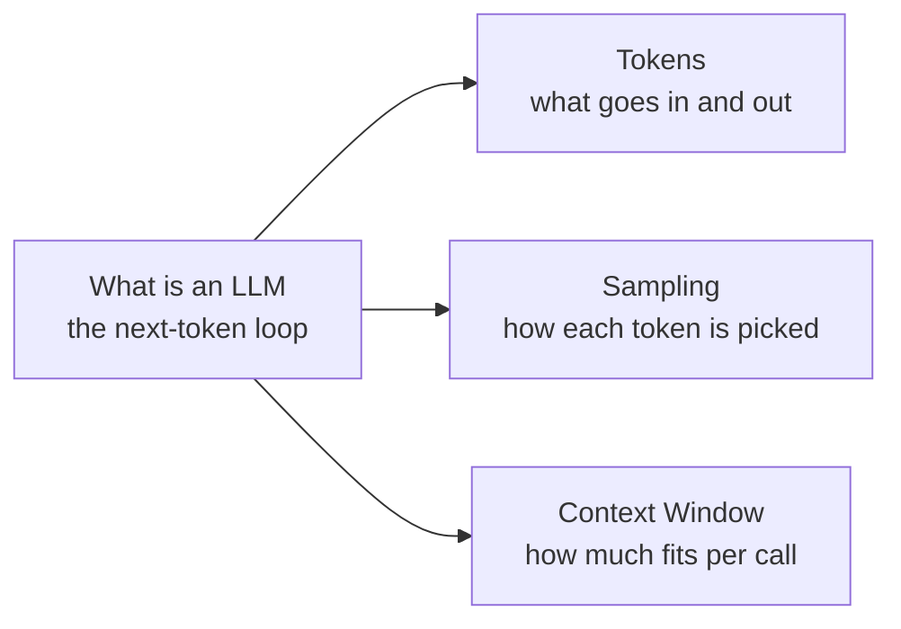

# LLM Basics

Start here if you're new to large language models. Each page is short and focused on the minimum mental model you need to use LLMs well in code.

## Start here

- [What is an LLM](what-is-an-llm.md) — the next-token-prediction loop that underlies everything else.
- [Tokens](tokens.md) — what the model actually sees, and why it matters for prompting and pricing.

## Going further

- [Sampling](sampling.md) — turning the next-token distribution into one token (temperature, `top_p`, `top_k`).
- [Context Window](context-window.md) — the token budget that caps every call.

## How the pages relate

Read *What is an LLM* first — it introduces the loop. The other three zoom into one specific piece of that loop:

