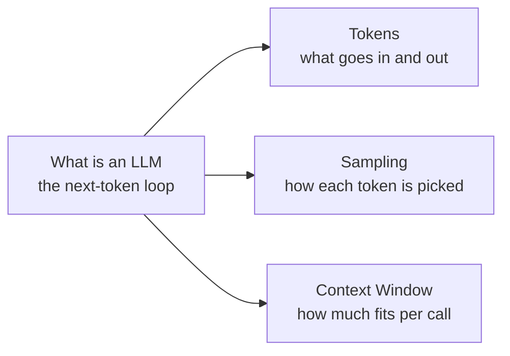

# LLM 基础

如果你对大语言模型完全陌生，请从这里开始。每一页都很短，只聚焦于在代码中用好 LLM 所需的最小心智模型。

## 从这里开始

- [什么是 LLM](what-is-an-llm.md) —— 支撑一切的"下一个词元预测"循环。
- [词元](tokens.md) —— 模型实际看到的是什么，以及这一点为何对提示与计费都很重要。

## 进一步阅读

- [采样](sampling.md) —— 把下一词元的概率分布变成一个具体的词元（温度、`top_p`、`top_k`）。
- [上下文窗口](context-window.md) —— 限制每次调用规模的词元预算。

## 这几页的关系

先看 *什么是 LLM* —— 它介绍整个循环。另外三页分别放大循环中的某一个环节：

