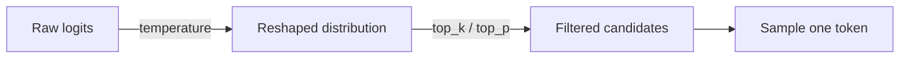

# Sampling

The model returns a probability distribution over every token in its vocabulary. **Sampling** is the step that chooses one. Three knobs shape this choice, and most APIs let you set all three: `temperature`, `top_p`, and `top_k`.

## The three knobs

Order matters: temperature reshapes the whole distribution first; `top_k` / `top_p` then discard the long tail; we sample from what remains.

### Temperature

`temperature` stretches or sharpens the distribution. For each token $i$ with raw logit $z_i$, the post-temperature probability is:

$$
p_i = \frac{\exp(z_i / T)}{\sum_j \exp(z_j / T)}
$$

$j$ just ranges over all tokens in the vocabulary so the probabilities sum to 1. Small `T` makes the peak steeper; large `T` flattens things out.

- `T = 0` — always pick the most likely token (greedy, deterministic).
- `T = 1` — use the model's distribution unchanged.
- `T > 1` — flatter, more variety.
- `T ≫ 1` — approaches uniform; usually nonsense.

Taking the illustrative distribution from [What is an LLM](what-is-an-llm.md) — prefix `"The PID controller"`, top candidates `is 0.51`, `controls 0.18`, `was 0.06`, `adjusts 0.04`, *(other)* `0.21` — the formula above gives:

| Token | `T=0` (greedy) | `T=0.5` | `T=1.0` (base) | `T=2.0` |
|---|---|---|---|---|
| ` is` | 1.00 | 0.76 | 0.51 | 0.35 |
| ` controls` | 0.00 | 0.09 | 0.18 | 0.21 |
| ` was` | 0.00 | 0.01 | 0.06 | 0.12 |
| ` adjusts` | 0.00 | 0.00 | 0.04 | 0.10 |
| *(other)* | 0.00 | 0.13 | 0.21 | 0.22 |

The `T=1` column is the illustrative base; the others are derived via `softmax(log(p) / T)` and are reproducible in a few lines of `numpy`.

### `top_k`

Keep the `k` tokens with the highest probability, throw the rest away, and renormalize the survivors so they sum to 1. Let $S$ be the set of those top-`k` tokens:

$$
p'_i = \frac{p_i}{\sum_{j \in S} p_j} \quad \text{if } i \in S,\ \text{else } 0
$$

You always sample from exactly `k` candidates, no matter how sharp or flat the distribution was. Simple but blunt; often left unset when `top_p` is already doing the job.

### `top_p` (nucleus sampling)

Walk down the sorted probabilities from largest to smallest and keep the smallest group $N$ (the "nucleus") whose cumulative sum already reaches `top_p`:

$$
\sum_{i \in N} p_i \geq \text{top\_p}
$$

Drop the rest, renormalize. Adaptive: a sharp distribution keeps only a handful of tokens (the nucleus is small); a flat one keeps many. Common settings: `top_p = 1.0` disables the filter, `top_p = 0.9` is a typical default, `top_p = 0.1` is very conservative.

## What temperature does to one prompt

Prompt: *"List three ideas for a control-systems side project."*

| Temperature | Typical behavior | Example first line |
|---|---|---|
| `0`   | Deterministic, identical every run | "1. Build a balancing cube..." |
| `0.3` | Slight variety, still focused | "1. Build an inverted pendulum demo..." |
| `0.7` | Creative and usable | "1. Hack a cheap quadcopter to fly a figure-eight trajectory..." |
| `1.5` | Often drifts or degrades | "1. Rockets that sing about tuning..." |

## When to use which

| Use case | Temperature | Notes |
|---|---|---|
| Code generation, data extraction, classification | `0` | Same input → same output. |
| Chat, Q&A, general assistant | `0.5 – 0.7` | Natural variety without losing focus. |
| Creative writing, brainstorming | `0.9 – 1.2` | Variety is the point. |
| Structured output / JSON mode | `0 – 0.2` | Schema adherence is easier when the distribution is sharp. |

A control-theory analogue: `T = 0` is a pure bang-bang policy (always the peak); higher `T` is a stochastic policy. In agent work, you almost always want a low `T` so the agent is reproducible when something goes wrong.

## Other params you'll encounter

- `frequency_penalty` / `presence_penalty` (OpenAI) — discourage repetition.
- `stop` — list of strings that terminate generation when emitted.
- `seed` — on OpenAI, makes generation reproducible when combined with `T = 0`.

Reach for these only when you have a specific problem they fix; temperature alone handles most cases.

## Next

- [Context Window](context-window.md) — the token budget that caps every call.
