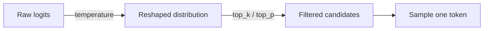

# 采样

模型会给出它词表中每个词元的概率分布。**采样** 就是从中挑出一个的那一步。有三个旋钮影响这次挑选，大多数 API 允许你同时设置这三个：`temperature`、`top_p` 和 `top_k`。

## 三个旋钮

顺序很关键：温度先把整个分布重新塑形；`top_k` / `top_p` 再丢掉长尾；最后我们在剩下的候选中采样。

### 温度

`temperature` 会拉伸或锐化分布。对于每个词元 $i$，若其原始 logit 为 $z_i$，经过温度调整后的概率为：

$$
p_i = \frac{\exp(z_i / T)}{\sum_j \exp(z_j / T)}
$$

$j$ 只是在整个词表上遍历，用来让所有概率加起来等于 1。`T` 越小，峰越尖；`T` 越大，分布越平。

- `T = 0` —— 永远挑最可能的词元（贪心，确定性）。
- `T = 1` —— 直接使用模型原本的分布。
- `T > 1` —— 更平，更多变化。
- `T ≫ 1` —— 趋近均匀分布；通常是乱码。

以 [什么是 LLM](what-is-an-llm.md) 中的示例分布为例 —— 前缀 `"The PID controller"`，候选 `is 0.51`、`controls 0.18`、`was 0.06`、`adjusts 0.04`、*（其余）* `0.21` —— 上面这条公式给出：

| 词元 | `T=0`（贪心） | `T=0.5` | `T=1.0`（原分布） | `T=2.0` |
|---|---|---|---|---|
| ` is` | 1.00 | 0.76 | 0.51 | 0.35 |
| ` controls` | 0.00 | 0.09 | 0.18 | 0.21 |
| ` was` | 0.00 | 0.01 | 0.06 | 0.12 |
| ` adjusts` | 0.00 | 0.00 | 0.04 | 0.10 |
| *（其余）* | 0.00 | 0.13 | 0.21 | 0.22 |

`T=1` 列是作为基准的示例分布；其余几列通过 `softmax(log(p) / T)` 推导而来，用几行 `numpy` 就能复现。

### `top_k`

保留概率最高的 `k` 个词元，其余丢弃，再把保留下来的归一化到总和为 1。令 $S$ 为这 `k` 个词元的下标集合：

$$
p'_i = \frac{p_i}{\sum_{j \in S} p_j} \quad \text{if } i \in S，\ \text{else } 0
$$

无论原分布是尖锐还是平坦，你总是从恰好 `k` 个候选中采样。方法粗暴但简单；在 `top_p` 已经在起作用时通常就不再单独设置 `top_k`。

### `top_p`（核采样）

从最大到最小依次沿排序后的概率走，保留累积和首次达到 `top_p` 的那一小组 $N$（即 "核"）：

$$
\sum_{i \in N} p_i \geq \text{top\_p}
$$

丢弃其余，归一化。它是自适应的：尖锐分布只保留几个词元（核很小）；平坦分布会保留很多。常见取值：`top_p = 1.0` 关闭该过滤，`top_p = 0.9` 是典型默认值，`top_p = 0.1` 非常保守。

## 温度对同一个提示的影响

提示：*"List three ideas for a control-systems side project."*

| 温度 | 典型行为 | 首行示例 |
|---|---|---|
| `0`   | 确定性，每次运行结果相同 | "1. Build a balancing cube..." |
| `0.3` | 略有变化，仍然聚焦 | "1. Build an inverted pendulum demo..." |
| `0.7` | 有创造性、可用 | "1. Hack a cheap quadcopter to fly a figure-eight trajectory..." |
| `1.5` | 容易跑题或退化 | "1. Rockets that sing about tuning..." |

## 何时用哪个

| 场景 | 温度 | 说明 |
|---|---|---|
| 代码生成、数据抽取、分类 | `0` | 相同输入 → 相同输出。 |
| 聊天、问答、通用助手 | `0.5 – 0.7` | 在不跑题的前提下保留自然变化。 |
| 创意写作、头脑风暴 | `0.9 – 1.2` | 变化正是想要的东西。 |
| 结构化输出 / JSON 模式 | `0 – 0.2` | 分布越尖，越容易遵循 schema。 |

一个控制理论上的类比：`T = 0` 是纯粹的 bang-bang 策略（永远取峰值）；更高的 `T` 是一个随机策略。在智能体相关工作中，你几乎总是希望 `T` 低一些，这样出问题时 agent 的行为才可复现。

## 其他你可能遇到的参数

- `frequency_penalty` / `presence_penalty`（OpenAI） —— 抑制重复。
- `stop` —— 一串触发生成提前结束的字符串。
- `seed` —— 在 OpenAI 上，当配合 `T = 0` 时让生成可复现。

这些只在你有具体问题需要它们解决时才动；温度一项就能覆盖大多数场景。

## 下一步

- [上下文窗口](context-window.md) —— 限制每次调用规模的词元预算。
