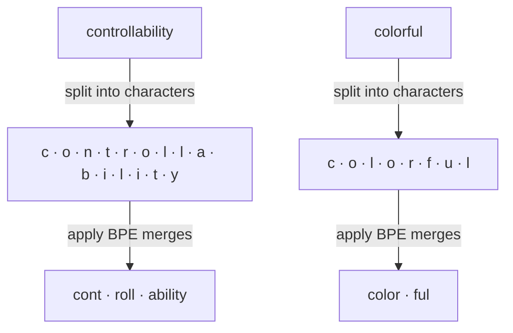

# Tokens

The model does not see your text — it sees **tokens**, a fixed vocabulary of roughly 50k–200k subword units built by Byte Pair Encoding (BPE) or a similar algorithm. Three consequences:

- Every API call is billed per token, not per character.
- The context window is a token limit, not a character limit.
- The tokenizer has edge cases that affect prompting (see below).

## How BPE builds the vocabulary

BPE starts from bytes (or characters) and repeatedly merges the most frequent adjacent pair until it reaches a target vocabulary size. At inference time, the learned merge rules are applied to your text, and the result is often a surprising split.

Two real examples from `gpt-4o-mini`:



Each `·` marks a token boundary. Note how the splits don't follow morphology — `controllability` breaks into `cont · roll · ability` (not `control · lability` or `controll · ability`), and `colorful` cleanly yields `color · ful`. High-frequency sequences collapse into one token (`"the"` is a single token); rare sequences stay split (an unusual surname might be 4 or 5 tokens).

## The gotchas

The same word tokenizes differently depending on surrounding context:

| Input | Tokens | Count |
|---|---|---|
| `color` | `color` | 1 |
| `colorful` | `color`, `ful` | 2 |
| ` color` (leading space) | ` color` | 1 — but a **different** token ID than `color` |
| `Color` | `Color` | 1 — yet another different ID |

Numbers split in ways that affect math. `gpt-4o-mini` chunks digits into groups of 3 from the left, with the remainder on the right:

| Input | Tokens | Count |
|---|---|---|
| `42` | `42` | 1 |
| `123` | `123` | 1 |
| `1234` | `123`, `4` | 2 |
| `12345` | `123`, `45` | 2 |
| `1000000` | `100`, `000`, `0` | 3 |
| `12345678` | `123`, `456`, `78` | 3 |
| `3.14159` | `3`, `.`, `141`, `59` | 4 |

This is part of why LLMs are surprisingly bad at arithmetic — the digit chunks don't align with place value, so `1,234,567 + 1` is a fundamentally harder operation for the model than it looks. It's also why structured-output helpers (JSON mode, tool calls) often do math via a tool call rather than the model itself.

## Try it in your browser

The fastest way to build intuition is to paste text into a live tokenizer and watch the colored chunks:

- **[tiktokenizer](https://tiktokenizer.vercel.app/)** — supports OpenAI, Llama, Mistral, and several other tokenizers. Switch models in the top bar to see how the same sentence shards differently.

Try pasting:

- `"The quick brown fox jumps over the lazy dog."` — English, clean split.
- `"colorful"` vs `" color"` vs `"Color"` — see how a leading space or capitalization changes the token IDs.
- `"1000000"` or a long credit-card-like number — watch the digit chunks.
- A sentence in Chinese or with emoji — expect many more tokens per visible character.

## Counting tokens locally

Use OpenAI's `tiktoken` to estimate cost before making a call:

```python title="count_tokens.py"
import tiktoken

enc = tiktoken.encoding_for_model("gpt-4o-mini")

text = "The quick brown fox jumps over the lazy dog."
tokens = enc.encode(text)

print(f"{len(tokens)} tokens")
print([enc.decode([t]) for t in tokens])
```

Install (already included in the project deps if you ran `pip install -e .`):

```bash
pip install tiktoken
```

For DeepSeek and Qwen, their docs ship their own tokenizer bindings. `tiktoken` counts are only exact for OpenAI models but usually land within 10–20% of the other providers for English text — good enough for back-of-envelope cost estimates.

## Next

- [Sampling](sampling.md) — turning the next-token distribution into one token.
