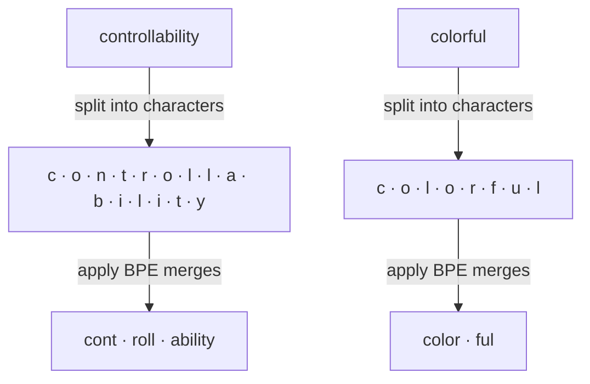

# 词元

[](https://colab.research.google.com/github/MarkJH2001/LLM-Control-Tutorial/blob/main/notebooks/tokens.ipynb)
[](https://deepnote.com/launch?url=https://github.com/MarkJH2001/LLM-Control-Tutorial/blob/main/notebooks/tokens.ipynb)

模型看不见你写的文字 —— 它看到的是**词元**，一个大约包含 5 万至 20 万个子词单元的固定词表，由字节对编码（BPE）或类似算法构建。这带来三个直接后果：

- 每次 API 调用按词元计费，不是按字符。
- 上下文窗口是词元数的上限，而不是字符数的上限。
- 分词器有一些会影响提示效果的边缘情况（详见下文）。

## BPE 如何构建词表

BPE 从字节（或字符）出发，反复合并出现频率最高的相邻对，直到词表达到目标大小。推理时，把学到的合并规则施加到你的文本上，结果往往是一种出人意料的切分。

下面是两个来自 `gpt-4o-mini` 的真实例子：



每个 `·` 标记一个词元边界。注意切分并不遵循词法学 —— `controllability` 被切成 `cont · roll · ability`（而不是 `control · lability` 或 `controll · ability`），而 `colorful` 则干净地切出 `color · ful`。高频序列会坍缩成单个词元（`"the"` 就是一个词元）；低频序列则保持切开（一个不常见的姓氏可能是 4 到 5 个词元）。

## 那些容易踩坑的地方

同一个单词在不同上下文里会被切成不同样子：

| 输入 | 词元 | 数量 |
|---|---|---|
| `color` | `color` | 1 |
| `colorful` | `color`， `ful` | 2 |
| ` color`（前面带空格） | ` color` | 1 —— 但词元 ID 与 `color` **不同** |
| `Color` | `Color` | 1 —— 又是一个不同的 ID |

数字的切分会影响算术。`gpt-4o-mini` 把数字从左向右按每 3 位分组，余数留在最右边：

| 输入 | 词元 | 数量 |
|---|---|---|
| `42` | `42` | 1 |
| `123` | `123` | 1 |
| `1234` | `123`， `4` | 2 |
| `12345` | `123`， `45` | 2 |
| `1000000` | `100`， `000`， `0` | 3 |
| `12345678` | `123`， `456`， `78` | 3 |
| `3.14159` | `3`， `.`， `141`， `59` | 4 |

这也是 LLM 为什么在算术上出乎意料地糟糕 —— 数字被切成的块并不与数位对齐，所以 `1,234,567 + 1` 对模型来说比看起来要难得多。这也是结构化输出辅助（JSON 模式、工具调用）通常通过调用工具来做数学，而不是让模型自己算的原因。

## 在浏览器里试一试

建立直觉最快的办法，是把文本粘进一个在线分词器里，观察彩色的分块：

- **[tiktokenizer](https://tiktokenizer.vercel.app/)** —— 支持 OpenAI、Llama、Mistral 及其他几种分词器。在顶栏切换模型，就能看到同一句话在不同分词器下是如何切分的。

试着粘入这些内容：

- `"The quick brown fox jumps over the lazy dog."` —— 英语，切分干净。
- `"colorful"` vs `" color"` vs `"Color"` —— 看看一个前导空格或大小写差异如何改变词元 ID。
- `"1000000"` 或一串像信用卡号那样的长数字 —— 观察数字分块。
- 一句中文或含 emoji 的句子 —— 你会发现每个可见字符往往要用更多词元。

## 在本地数词元数

用 OpenAI 的 `tiktoken` 在发起调用前估算成本：

```python title="count_tokens.py"
import tiktoken

enc = tiktoken.encoding_for_model("gpt-4o-mini")

text = "The quick brown fox jumps over the lazy dog."
tokens = enc.encode(text)

print(f"{len(tokens)} tokens")
print([enc.decode([t]) for t in tokens])
```

安装（如果你已经跑过 `pip install -e .`，那它已经被装上了）：

```bash
pip install tiktoken
```

DeepSeek 和 Qwen 的文档各自提供了它们自己的分词器绑定。`tiktoken` 的计数只对 OpenAI 模型精确，但在英文文本上相对其他服务商一般偏差在 10——20% 之内 —— 用来做粗略成本估算足够了。

## 下一步

- [采样](sampling.md) —— 把下一词元的概率分布变成一个具体的词元。
