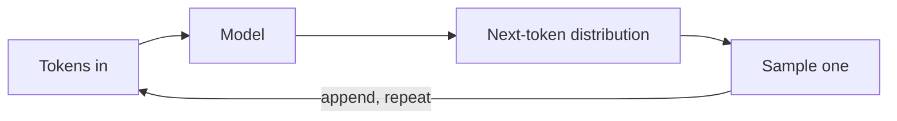

# What is an LLM

An LLM — *large language model* — is, at heart, a function that maps a sequence of tokens to a probability distribution over the next token. You sample from that distribution, append the result to the input, and call the model again. Everything you see an LLM do — chat, code, reason, use tools — emerges from running this loop millions of times.

## The loop

"Stop" usually means either an end-of-sequence token or a user-specified limit (`max_tokens`).

## A concrete example

Given the prefix `"The PID controller"`, the model's next-token distribution might look like:

| Candidate token | Probability |
|---|---|
| ` is` | 0.51 |
| ` controls` | 0.18 |
| ` was` | 0.06 |
| ` adjusts` | 0.04 |
| *(thousands of others)* | … |

The [sampler](sampling.md) picks one — temperature controls how far down the list it will go — we append it to the prefix, and repeat.

## Pretraining vs. post-training

- **Pretraining.** Trillions of tokens of internet text, next-token prediction only. Produces a model that is fluent but wanders, doesn't follow instructions well, and has no stable style.
- **Post-training.** Supervised fine-tuning on curated examples plus RLHF or DPO. Turns the pretrained base into a model that follows instructions, refuses unsafe requests, and stays on task.

Every model you reach via an API has been post-trained. Access to raw base models is rare outside open-weight releases.

## Why "predict the next token" is useful

Next-token prediction at scale forces the model to compress the patterns in its training data: syntax, factual associations, code structure, dialog conventions. Asking it to continue a well-framed prompt pulls out those compressed patterns. **The cleverness lives in the prompt and the loop around the model**, not in a reasoning engine inside the model. That's why the rest of this tutorial spends so much time on how to shape inputs and iterate.

## Next

- [Tokens](tokens.md) — what the model actually sees, and why that matters for prompting and pricing.
- [Sampling](sampling.md) — how we pick the next token from the distribution.
