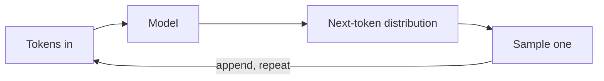

# 什么是 LLM

LLM —— *大语言模型* —— 本质上是一个函数：它把一串词元映射成下一个词元上的概率分布。你从该分布中采样一个词元，把它追加到输入末尾，然后再次调用模型。你看到 LLM 做的所有事 —— 聊天、写代码、推理、使用工具 —— 都来自把这个循环重复几百万次。

## 循环

"停止" 通常意味着遇到一个序列结束词元，或者触发了用户指定的上限（`max_tokens`）。

## 一个具体例子

给定前缀 `"The PID controller"`，模型下一词元的概率分布可能长这样：

| 候选词元 | 概率 |
|---|---|
| ` is` | 0.51 |
| ` controls` | 0.18 |
| ` was` | 0.06 |
| ` adjusts` | 0.04 |
| *（其余数千项）* | … |

[采样器](sampling.md) 会挑中其中一个 —— 温度决定它会沿这张列表往下走多远 —— 把它追加到前缀后，然后重复。

## 预训练 vs. 后训练

- **预训练。** 上万亿词元的互联网文本，只做下一词元预测。产出的模型语言流畅却容易跑题，不太会听指令，也没有稳定风格。
- **后训练。** 在筛选过的示例上做有监督微调，再配合 RLHF 或 DPO。把预训练的基座模型训练成会遵循指令、会拒绝不安全请求、会保持任务聚焦的模型。

你通过 API 访问到的每一个模型都经过后训练。原始的基座模型除了开源权重以外很少有渠道接触。

## 为什么 "预测下一个词元" 是有用的

大规模的下一词元预测迫使模型压缩训练数据里的各种模式：语法、事实关联、代码结构、对话约定。让它去续写一段构造良好的提示，等于把这些被压缩的模式取出来。**真正的巧妙之处在于提示以及围绕模型构建的循环**，而不是模型内部藏着一个推理引擎。这也是本教程其余部分要花大量篇幅讨论如何塑造输入和迭代的原因。

## 下一步

- [词元](tokens.md) —— 模型实际看到的是什么，以及这一点为何对提示与计费都很重要。
- [采样](sampling.md) —— 我们如何从分布中挑出下一个词元。
